# Chapter 4. 디지털 전송 (Digital Transmission)

> 기준 자료: `Chapter 4 - 37.pdf`, 교재 99~135쪽  
> 정리 방식: 교재의 실제 절 순서에 따라 개념을 풀어 쓰고, 각 개념이 왜 필요한지 연결해서 설명한다.  
> 주의: 첨부 PDF는 135쪽이 파일 첫 장에 놓여 있으므로, 이 문서는 교재 순서인 99쪽부터 135쪽까지로 재배열해 정리했다.

---

## 범위 및 다루는 계층

- **범위**
  - 4.1 디지털 대 디지털 변환
  - 4.2 아날로그 대 디지털 변환
  - 4.3 전송 방식
  - 4.4 추천도서
  - 4.5 핵심용어
  - 4.6 요약
  - 4.7 연습문제 안내
- **주로 다루는 계층**: OSI **물리 계층(Physical Layer)**
- **물리 계층에서의 질문**: 이미 만들어진 0과 1을 전선·광섬유·무선 매체가 실제로 운반할 수 있는 신호로 어떻게 표현하고, 신호의 타이밍을 어떻게 맞추며, 어느 정도의 대역폭으로 보낼 것인가?
- **이 장에서 직접 다루지 않는 것**: MAC 주소, 프레임 전달, 오류 재전송, 라우팅. 블록 코딩이 일부 오류를 발견할 수는 있지만, 여기서 중심은 링크 계층의 오류 제어가 아니라 **물리 신호를 전송하기 좋은 모양으로 만드는 것**이다.

## 리딩 포인트

1. **데이터와 신호는 다르다.** 비트는 전달할 정보이고, 전압·빛·전파의 변화는 그 비트를 실어 나르는 신호이다.
2. **비트율과 보오율도 다르다.** 한 번의 신호 변화에 여러 비트를 담으면 비트율은 높으면서 보오율은 낮출 수 있다.
3. **좋은 회선 부호는 단순히 0과 1만 구분하는 것이 아니다.** 동기화가 가능하고, 직류 성분이 적으며, 기준선 표류와 긴 무변화 구간을 피해야 한다.
4. **블록 코딩과 뒤섞기는 회선 부호의 약점을 보완한다.** 블록 코딩은 여분 비트를 더하고, 뒤섞기는 비트 수를 늘리지 않은 채 특정 패턴을 치환한다.
5. **PCM은 아날로그 신호를 채집 → 계수화 → 부호화한다.** 이때 채집률, 계수화 준위 수, 표본당 비트 수가 최종 비트율과 대역폭을 결정한다.
6. **전송 방식은 선의 수와 타이밍 관리 방법을 결정한다.** 병렬/직렬, 그리고 비동기/동기/등시식의 차이를 구별해야 한다.

## 장 전체 흐름

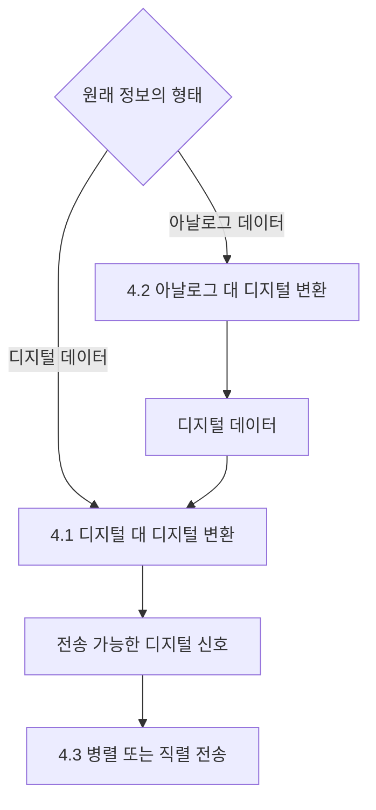

핵심 흐름은 다음과 같다.

- 컴퓨터 안의 **디지털 데이터**는 회선 부호화로 바로 디지털 신호가 될 수 있다.
- 음성처럼 원래 **아날로그인 데이터**는 먼저 PCM이나 DM으로 디지털 데이터가 되어야 한다.
- 그렇게 얻은 비트는 다시 회선 부호화를 거쳐 실제 링크에 실린다.
- 마지막으로 여러 비트를 여러 선에 동시에 보낼지, 한 선으로 차례대로 보낼지 결정한다.

---

# 4.1 디지털 대 디지털 변환

> 교재 99~118쪽

디지털 데이터 `0, 1, 1, 0, ...`는 그 자체로 구리선이나 광섬유를 이동하지 못한다. 송신기는 각 비트 또는 비트 묶음을 전압 준위나 전압 변화로 바꾸고, 수신기는 그 신호를 다시 비트로 해석한다.

이 변환에는 세 가지 기술이 있다.

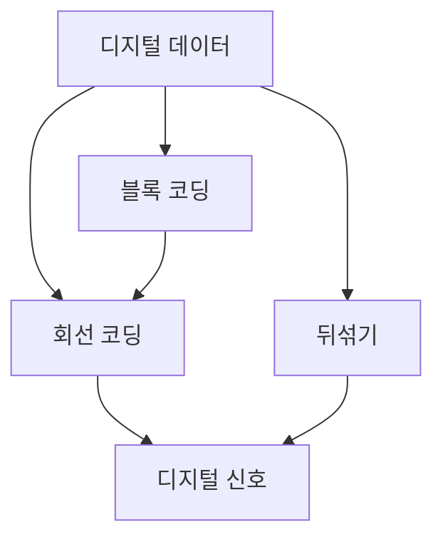

- **회선 코딩(Line coding)**: 반드시 필요하다. 비트열을 전압·빛 등의 디지털 신호로 직접 바꾼다.
- **블록 코딩(Block coding)**: 필요할 때 회선 코딩 앞에 붙인다. 여분 비트를 추가해 동기화와 제한적인 오류 검출 능력을 높인다.
- **뒤섞기(Scrambling)**: 필요할 때 회선 코딩 규칙과 함께 쓴다. 비트 수를 늘리지 않고 문제가 되는 긴 0 구간 등을 특별한 신호 패턴으로 치환한다.

## 4.1.1 회선 코딩 (Line Coding)

### 회선 코딩과 복호화

송신기의 **부호기(encoder)**는 디지털 데이터를 디지털 신호로 바꾸고, 수신기의 **복호기(decoder)**는 수신 신호를 다시 디지털 데이터로 바꾼다.


여기서 중요한 점은 **데이터의 단위**와 **신호의 단위**를 구분하는 것이다.

### 신호 요소 대 데이터 요소

| 구분 | 데이터 요소(Data element) | 신호 요소(Signal element) |
|---|---|---|
| 뜻 | 전달하려는 정보의 가장 작은 단위 | 시간축에서 구별되는 디지털 신호의 가장 짧은 단위 |
| 이 장의 기준 | 보통 1비트 | 하나의 전압 준위 또는 하나의 신호 구간 |
| 예 | `0`, `1` | `+V`, `0V`, `-V`로 유지되는 한 구간 또는 한 번의 전이 패턴 |
| 비유 | 이동해야 하는 사람 | 사람을 태우는 차량 |

한 신호 요소가 실어 나르는 데이터 요소 수를 (r)이라고 한다.

- 신호 요소 1개가 비트 1개를 운반: (r=1)
- 비트 1개를 표현하는 데 신호 요소 2개가 필요: (r=1/2)
- 신호 요소 1개가 비트 2개를 운반: (r=2)
- 신호 요소 3개가 비트 4개를 운반: (r=4/3)

즉, (r)이 클수록 한 번의 신호 표현에 더 많은 비트를 담는 방식이다.

### 데이터 전송률 대 신호 전송률

| 항목 | 데이터 전송률 | 신호 전송률 |
|---|---|---|
| 기호 | (N) | (S) |
| 의미 | 1초 동안 전송한 데이터 요소의 수 | 1초 동안 전송한 신호 요소의 수 |
| 단위 | bit/s 또는 bps | baud(보오) |
| 다른 이름 | 비트율(bit rate) | 보오율, 펄스율, 변조율 |

교재의 평균 신호율 관계식은 다음과 같다.

$$
S = c \times N \times \frac{1}{r}\quad\text{baud}
$$

- (N): 비트율
- (r): 신호 요소 하나가 운반하는 비트 수
- (c): 실제 데이터 패턴에 따라 신호가 얼마나 자주 바뀌는지를 반영하는 **경우 요인(case factor)**
- 평균적인 상황에서는 흔히 (c=1/2)로 가정한다.

#### 왜 (N/r)인가?

비트가 초당 (N)개 들어오고, 신호 요소 하나가 평균 (r)비트를 운반한다면 필요한 신호 요소 수는 (N/r)개이다. 그러나 모든 비트 패턴이 매번 최대 변화를 일으키는 것은 아니므로, 여기에 실제 변화 비율 (c)를 곱한다.

- 최악의 패턴: (S_{max}=N/r)
- 변화가 전혀 없는 최선의 패턴: 이론상 (S_{min}=0)
- 평균 패턴: (S_{avg}=cN/r)

#### 교재 예제 4.1

한 신호 요소가 한 비트를 운반하므로 $r=1$, 비트율이 $100\text{ kbps}$, 평균 경우 요인이 $c=1/2$라면

$$
S=\frac{1}{2}\times100{,}000\times\frac{1}{1}=50{,}000\text{ baud}=50\text{ kbaud}
$$

여기서 **100 kbps와 50 kbaud가 동시에 맞다.** 초당 100,000비트를 보내지만, 평균적으로 신호 상태를 구별해야 하는 사건은 초당 약 50,000번이라는 뜻이다.

### 대역폭

이상적인 직사각형 디지털 신호에는 무한히 많은 고주파 성분이 들어 있으므로 이론적 대역폭은 무한하다. 하지만 높은 주파수 성분으로 갈수록 에너지가 작아지므로, 실제 전송에서는 신호를 구별하는 데 중요한 부분만 포함한 **유효 대역폭**을 사용한다.

교재의 핵심 관점은 다음과 같다.

> 비트가 몇 개인가보다 신호가 얼마나 자주 변하는가, 즉 **보오율**이 요구 대역폭을 더 직접적으로 결정한다.

평균적인 최소 대역폭은 다음처럼 나타낸다.

$$
B_{min}=c\times N\times\frac{1}{r}
$$

반대로 채널 대역폭 (B)가 정해져 있으면 가능한 최대 데이터율을 다음처럼 쓸 수 있다.

$$
N_{max}=\frac{1}{c}\times B\times r
$$

평균 경우 $c=1/2$, 한 신호 요소가 $r=\log_2L$비트를 표현한다고 놓으면

$$
N_{max}=2B\log_2L
$$

이는 3장에서 배운 **잡음 없는 채널의 나이퀴스트 비트율**과 연결된다. (L)은 신호가 구별할 수 있는 준위의 수이다. 준위가 (L)개이면 한 신호 요소가 나타낼 수 있는 비트 수는 (log_2L)이다.

### 좋은 회선 코딩이 갖추어야 할 특성

#### 1. 기준선 표류 (Baseline Wandering)

수신기는 들어오는 신호 세기의 이동 평균을 기준선으로 삼아 현재 신호가 높은지 낮은지 판단한다. 그런데 같은 전압이 오래 지속되면 이동 평균 자체가 그쪽으로 이동한다. 그러면 원래 신호와 기준선의 차이가 작아져 수신기가 0과 1을 잘못 판단할 수 있다.

- 원인: 긴 무변화 구간, 특히 긴 0 또는 긴 1
- 해결 방향: 비트열 안에 충분한 전이가 생기는 부호 사용

#### 2. 직류 성분 (DC Component)

신호 에너지가 주파수 0Hz 근처에 몰리면 직류 성분이 생긴다. 변압기나 커패시터로 결합된 링크는 0Hz 부근을 통과시키지 못하므로 신호가 크게 왜곡될 수 있다. 전화망처럼 매우 낮은 주파수를 차단하는 시스템에도 맞지 않는다.

- 원인: 양·음 전압의 평균이 0이 되지 않는 신호
- 해결 방향: 양과 음의 펄스가 장기적으로 상쇄되는 부호 사용

#### 3. 자기 동기화 (Self-Synchronization)

수신기는 단순히 전압값만 알아서는 안 되고 **각 비트가 어디에서 시작하고 끝나는지**도 알아야 한다. 송신기와 수신기의 시계가 조금만 달라도 시간이 지날수록 비트 경계가 어긋난다.

자기 동기화 신호는 비트 내부의 전이를 이용해 타이밍 정보를 함께 보낸다. 수신기는 예상 시점에 전이가 나타나는지를 보며 자신의 시계를 계속 조정할 수 있다.

교재의 시계 오차 예를 그대로 계산하면 다음과 같다.

- 수신기 시계가 송신기보다 0.1% 빠름
- 1 kbps 송신 → 수신기는 약 1001 bps로 셈 → 초당 1비트 오차
- 1 Mbps 송신 → 수신기는 약 1,001,000 bps로 셈 → 초당 1,000비트 오차

속도가 높아질수록 작은 비율의 시계 오차도 큰 비트 수 오차로 커진다.

#### 4. 내장 오류 검출

어떤 회선 부호는 정상 데이터라면 절대로 나타나지 않는 신호 패턴을 가진다. 수신기가 그런 금지 패턴을 발견하면 전송 중 오류가 있었음을 알 수 있다. 다만 이것만으로 모든 오류를 검출하거나 복구할 수 있는 것은 아니다.

#### 5. 잡음과 방해 신호에 대한 면역

신호 준위의 간격이 충분하고 판정 규칙이 전압의 절대값보다 전이 여부에 의존하면, 일부 잡음이나 선의 극성 반전에도 더 강할 수 있다.

#### 6. 복잡도

신호 준위를 많이 쓰거나 이전 상태를 기억해야 하는 부호는 같은 비트율에서 대역폭을 아낄 수 있지만, 송수신 회로와 판정 과정은 더 복잡해진다. **대역폭 절약과 구현 복잡도 사이의 교환 관계**가 생긴다.

## 4.1.2 회선 코딩 방식

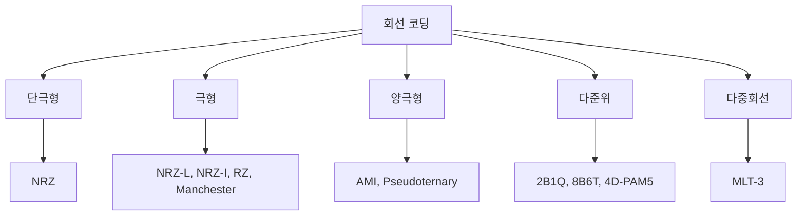

### 단극형 (Unipolar)

단극형은 시간축을 기준으로 한쪽 전압만 사용한다.

#### 단극형 NRZ

- 비트 1: (+V)
- 비트 0: (0V)
- NRZ(Non-Return-to-Zero): 비트 중간에 0V로 돌아가지 않고, 해당 전압을 비트 구간 전체에 유지한다.

장점은 매우 단순하다는 것이다. 하지만 평균 전압이 0이 아니어서 직류 성분이 크고, 같은 값이 길게 이어지면 동기화가 어렵다. 같은 부하에서 극형 부호보다 정규화 전력을 더 소비한다. 이 때문에 오늘날에는 거의 사용하지 않는다.

### 극형 (Polar)

극형은 (+V)와 (-V) 두 극성을 사용한다.

#### 극형 NRZ-L

- 교재 그림의 규칙: (0=+V), (1=-V)
- **전압 준위(Level)** 자체가 비트값을 결정한다.

장점은 단순하고 평균 대역폭이 약 (N/2)라는 것이다. 그러나 긴 0 또는 긴 1에서는 전이가 없어 동기화가 깨지고, 선의 극성이 반대로 연결되면 0과 1이 통째로 뒤집힐 수 있다. 직류 성분도 존재한다.

> 실제 표준에 따라 0과 1에 배정하는 극성은 바뀔 수 있다. 핵심은 절대 전압 준위로 값을 판정한다는 점이다.

#### 극형 NRZ-I

- 비트 1: 비트 시작점에서 전압을 반전
- 비트 0: 전압을 그대로 유지
- **전압이 바뀌었는지(Inversion)**가 비트값을 결정한다.

절대 극성이 아니라 변화 여부를 보므로 선의 극성이 통째로 반전되어도 데이터 판정이 유지된다. 긴 1은 매 비트마다 전이가 생기지만 긴 0에서는 전이가 사라져 동기화 문제가 남는다. 평균 대역폭은 약 (N/2)이고 직류 성분도 남는다.

#### RZ (Return-to-Zero)

RZ는 (+V, 0V, -V)의 세 준위를 사용한다.

- 비트의 앞 절반: 0 또는 1을 (+V)나 (-V)로 표현
- 비트의 뒤 절반: 항상 0V로 복귀

각 비트 안에 전이가 생겨 NRZ보다 동기화가 쉽고 직류 성분 문제도 줄어든다. 하지만 한 비트를 두 신호 구간으로 표현하므로 (r=1/2), 평균 신호율과 최소 대역폭이 약 (N)까지 증가한다. 세 준위를 만들어 구별해야 하므로 회로도 복잡하다. 그래서 실무에서는 RZ 자체보다 맨체스터 계열이 더 널리 쓰였다.

#### 맨체스터 (Manchester)

모든 비트의 **중간에서 반드시 전압을 반전**한다.

- 교재 규칙: 중간의 음→양 전이는 1, 양→음 전이는 0
- 중간 전이의 역할 1: 비트값 표현
- 중간 전이의 역할 2: 수신기 시계 동기화

항상 비트 중간에 전이가 있으므로 자기 동기화가 되고 직류 성분도 없다. 다만 비트마다 최소 한 번 전이가 필요해 평균 신호율과 대역폭이 NRZ의 약 두 배, 즉 약 (N)이다.

#### 차분 맨체스터 (Differential Manchester)

비트 중간의 전이는 항상 존재하며 동기화에 사용한다. 데이터값은 비트 시작점의 전이 여부로 구별한다.

- 비트 시작점에 전이가 있음: 0
- 비트 시작점에 전이가 없음: 1

절대 극성이 아니라 전이 여부만 보므로 극성 반전에 강하다. 맨체스터처럼 자기 동기화되고 직류 성분이 없지만, 대역폭은 역시 약 (N)으로 크다.

### 양극형 (Bipolar)

양극형은 (+V, 0V, -V) 세 준위를 쓰되, 한 이진값은 0V로 표현하고 다른 이진값은 양·음 펄스를 번갈아 사용한다. 양과 음의 면적이 장기적으로 상쇄되어 직류 성분이 거의 사라진다.

#### AMI (Alternate Mark Inversion)

- 비트 0: (0V)
- 비트 1: 나타날 때마다 (+V, -V, +V, -V, ...)로 교대

`mark`는 전신 분야에서 1을 뜻한다. 따라서 이름은 “1의 극성을 번갈아 뒤집는다”는 의미이다.

장점:

- 직류 성분이 없다.
- 연속된 1에는 전이가 많아 동기화에 유리하다.
- 같은 극성의 1 펄스가 연속되면 AMI 위반이므로 일부 오류를 검출할 수 있다.
- 평균 대역폭은 약 (N/2)이다.

단점:

- 긴 0에서는 신호가 계속 0V이므로 동기화가 깨진다.

#### 가상전수 (Pseudoternary)

AMI에서 0과 1의 역할만 바꾼다.

- 비트 1: (0V)
- 비트 0: (+V, -V)를 교대로 사용

따라서 직류 성분은 없지만, 이번에는 긴 1이 동기화 문제를 만든다.

### 다준위 방식 (Multilevel)

다준위 방식의 목적은 **한 신호 요소에 여러 비트를 담아 보오율과 대역폭을 낮추는 것**이다.

일반적으로 (m)개의 이진 데이터 비트를 (n)개의 신호 요소로 바꾸고, 신호 준위를 (L)개 사용한다. 이를 (mB/nL) 부호화라고 쓴다.

- (m): 입력 데이터 비트 수
- (B): 입력이 이진수(Binary)임을 표시
- (n): 출력 신호 요소 수
- (L): 각 신호 요소가 가질 수 있는 준위 수

가능한 데이터 패턴은 (2^m)개, 가능한 신호 패턴은 (L^n)개이므로 부호화가 가능하려면

$$
2^m\le L^n
$$

이어야 한다.

- (2^m=L^n): 모든 신호 패턴을 데이터 표현에 써야 하므로 여분 패턴이 없다.
- (2^m<L^n): 남는 패턴을 동기화, 직류 균형, 오류 검출에 활용할 수 있다.
- (2^m>L^n): 신호 패턴이 부족하므로 모든 데이터를 표현할 수 없다.

#### 2B1Q

이름 그대로 2개의 이진 비트를 1개의 4준위(Quaternary) 신호로 바꾼다.

- (m=2, n=1, L=4)
- (2^2=4^1), 따라서 여분 패턴은 없다.
- 신호 준위 예: (-3, -1, +1, +3)
- 한 신호 요소가 2비트를 운반하므로 (r=2)
- 평균 신호율과 대역폭은 NRZ-L의 약 절반인 (N/4)

교재의 대표 매핑은 직전 신호의 극성을 함께 고려한다.

| 다음 2비트 | 직전 준위가 양수일 때 | 직전 준위가 음수일 때 |
|---:|---:|---:|
| 00 | +1 | -1 |
| 01 | +3 | -3 |
| 10 | -1 | +1 |
| 11 | -3 | +3 |

이 매핑은 낮은 준위와 높은 준위, 같은 극성과 반대 극성을 조합해 네 비트 패턴을 구별한다.

장점은 대역폭 절약이고, 단점은 수신기가 네 전압 준위를 정확히 구별해야 한다는 점이다. 긴 같은 2비트 묶음에서는 동기화가 어려울 수 있다. 가입자 전화선을 사용하는 DSL 계열에서 활용되었다.

#### 8B6T

8비트를 6개의 3준위(Ternary) 신호 요소로 바꾼다.

- 입력 패턴: (2^8=256)개
- 가능한 신호 패턴: (3^6=729)개
- 사용하지 않는 473개 패턴을 직류 균형, 동기화, 오류 검출 등에 활용할 수 있다.

각 코드 그룹의 직류 합이 0 또는 (+1)이 되도록 설계하고, 합이 (+1)인 패턴은 필요에 따라 전체 극성을 뒤집어 장기 직류 균형을 맞춘다. 실제 최소 대역폭은 약 (3N/4)이다. 100BASE-4T에서 사용된 방식이다.

#### 4D-PAM5

4D는 데이터를 네 개의 회선, 즉 네 차원으로 동시에 보내는 것을 뜻하고, PAM5는 각 회선에서 다섯 전압 준위를 사용한다는 뜻이다.

- 사용 준위: (-2, -1, 0, +1, +2)
- 0 준위는 전진 오류 검출·제어 목적에 주로 사용한다.
- 데이터 표현에는 네 개 준위를 사용하므로 네 회선의 조합 수는 (4^4=256=2^8)이다.
- 8비트 묶음을 네 회선의 한 동시 신호 패턴으로 표현한다.
- 각 회선 관점의 최소 대역폭은 약 (N/8)이다.

기가비트 이더넷은 1 Gbps 데이터를 네 회선으로 나눠 각 회선에 250 Mbps씩 배정하고, 회선당 125 Mbaud 수준으로 전송한다.

### 다중회선 전송 3준위 (MLT-3)

MLT-3은 (-V, 0V, +V) 세 상태와 상태 전이 규칙을 함께 사용한다.

1. 다음 비트가 0이면 현재 준위를 유지한다.
2. 다음 비트가 1이고 현재가 (+V) 또는 (-V)이면 다음 준위는 0V이다.
3. 다음 비트가 1이고 현재가 0V이면, 다음 준위는 직전에 사용한 비영(0이 아닌) 준위의 반대 극성이다.

연속된 1이 들어오면 준위는 보통 다음처럼 순환한다.

```text
0V → +V → 0V → -V → 0V → +V → ...
```

네 번의 1이 들어와야 한 주기를 이루므로 가장 빠른 기본 반복 주파수는 비트율의 약 (1/4)이다. 실제 요구 대역폭은 데이터 패턴을 고려해 약 (N/3)으로 본다. 긴 0에서는 전이가 없다는 단점이 있지만, 고주파 성분을 줄여 제한된 구리선으로 100 Mbps를 보내는 데 유리하다.

### 회선 코딩 방식 비교

| 범주 | 방식 | 평균/최소 대역폭의 대표값 | 자기 동기화와 핵심 특성 |
|---|---|---:|---|
| 단극형 | NRZ | (N/2) | 긴 0·1에서 동기화 불가, 직류 성분 큼, 전력 소모 큼 |
| 극형 | NRZ-L | (N/2) | 긴 0·1에서 동기화 불가, 극성 반전에 취약, 직류 성분 |
| 극형 | NRZ-I | (N/2) | 긴 0에서 동기화 불가, 극성 반전에 강함, 직류 성분 |
| 극형 | RZ | (N) | 비트마다 0으로 복귀, 동기화 양호, 세 준위와 큰 대역폭 |
| 극형 | Manchester 계열 | (N) | 자기 동기화, 직류 성분 없음, 대역폭 큼 |
| 양극형 | AMI | (N/2) | 긴 0에서 동기화 불가, 직류 성분 없음, 일부 오류 검출 |
| 다준위 | 2B1Q | (N/4) | 대역폭 작음, 네 준위 판정 필요, 여분 패턴 없음 |
| 다준위 | 8B6T | (3N/4) | 자기 동기화와 직류 균형 가능, 부호화 복잡 |
| 다준위 | 4D-PAM5 | 회선당 (N/8) | 네 회선 병렬 사용, 자기 동기화와 직류 균형 가능 |
| 다중회선 | MLT-3 | (N/3) | 고주파 성분 감소, 긴 0에서 동기화 불가 |

> 대역폭 값은 교재가 제시하는 대표적인 평균 또는 최소값이다. 실제 시스템의 점유 대역폭은 필터, 펄스 모양, 허용 왜곡, 데이터 패턴에 따라 달라진다.

## 4.1.3 블록 코딩 (Block Coding)

회선 부호만으로 전이가 충분하지 않으면 수신기가 비트 경계를 잃을 수 있다. 블록 코딩은 입력 비트 묶음을 더 긴 출력 비트 묶음으로 바꾸어 **의도적으로 여분 패턴을 만든다.**


일반적인 (mB/nB) 블록 코딩은 (m)비트 입력을 (n)비트 출력으로 바꾸며 (n>m)이다.

- **나누기**: 입력 비트열을 (m)비트 그룹으로 분할
- **대치**: 각 (m)비트 그룹을 미리 정한 (n)비트 코드로 변환
- **조합**: 변환된 (n)비트 코드들을 다시 연속 비트열로 결합

여분 코드의 목적은 다음과 같다.

- 긴 0 또는 긴 1을 제한해 동기화 유지
- 사용하지 않는 코드가 수신되면 오류 감지
- 일부 코드를 시작, 끝, 유휴 상태 같은 제어 목적으로 사용

### 4B/5B

4B/5B는 4비트를 5비트 코드로 바꾸고, 보통 그 결과를 NRZ-I로 회선 부호화한다.

NRZ-I는 1에서 전이가 생기므로 긴 0이 문제다. 4B/5B는 각 5비트 코드가 앞에서 0을 두 개 이상 연속해 시작하지 않고, 뒤에서 0을 세 개 이상 연속해 끝내지 않도록 코드를 고른다. 코드 경계를 이어도 0이 세 개보다 길게 계속되지 않으므로 NRZ-I가 주기적으로 전이를 만든다.

#### 4B/5B 데이터 매핑

| 4비트 | 5비트 코드 | 4비트 | 5비트 코드 |
|---:|---:|---:|---:|
| 0000 | 11110 | 1000 | 10010 |
| 0001 | 01001 | 1001 | 10011 |
| 0010 | 10100 | 1010 | 10110 |
| 0011 | 10101 | 1011 | 10111 |
| 0100 | 01010 | 1100 | 11010 |
| 0101 | 01011 | 1101 | 11011 |
| 0110 | 01110 | 1110 | 11100 |
| 0111 | 01111 | 1111 | 11101 |

32개의 5비트 조합 중 데이터에 필요한 것은 16개뿐이다. 남는 일부 코드는 유휴, 시작, 끝, 리셋 같은 제어 용도로 사용하고, 나머지는 금지 코드로 남겨 오류 검출에 이용한다.

#### 4B/5B의 비용과 효과

- 4비트가 5비트가 되므로 비트율은 원래의 (5/4=1.25)배가 된다.
- 즉 25%의 비트 오버헤드가 생긴다.
- 원래 데이터가 1 Mbps라면 블록 코딩 뒤에는 1.25 Mbps이다.
- 이를 NRZ-I로 보내면 대표 최소 대역폭은 $1.25/2=0.625\text{ MHz}$이다.
- 맨체스터로 원래 1 Mbps를 보내면 약 1 MHz가 필요하므로, 4B/5B+NRZ-I가 더 작은 대역폭으로 동기화를 확보한다.
- 단, NRZ-I의 직류 성분 문제 자체는 해결하지 못한다.

#### 4B/5B 제어 코드

사용하지 않는 5비트 조합 중 일부는 데이터가 아닌 링크 상태를 표시한다.

| 제어 문자 | 의미 | 5비트 코드 |
|---:|---|---:|
| Q | Quiet | 00000 |
| I | Idle | 11111 |
| H | Halt | 00100 |
| J | Start delimiter | 11000 |
| K | Start delimiter | 10001 |
| T | End delimiter | 01101 |
| S | Set | 11001 |
| R | Reset | 00111 |

### 8B/10B

8B/10B는 8비트를 10비트로 바꾸는 더 정교한 블록 코딩이다.

- 앞 5비트는 5B/6B 부호기로 보낸다.
- 뒤 3비트는 3B/4B 부호기로 보낸다.
- 불균형 제어기(disparity controller)가 지금까지의 1과 0의 수 차이를 추적한다.
- 필요하면 같은 데이터를 나타내는 반대 극성 코드를 골라 장기적으로 1과 0의 수를 균형 있게 만든다.

10비트 조합은 (2^{10}=1024)개이고 데이터 입력은 (2^8=256)개뿐이다. 남는 많은 조합은 대체 코드, 제어 문자, 오류 검출에 활용된다. 4B/5B와 마찬가지로 25% 오버헤드가 있지만, 직류 균형과 동기화, 오류 탐지 능력이 더 좋다.

## 4.1.4 뒤섞기 (Scrambling)

블록 코딩은 동기화를 개선하지만 비트 수와 비트율을 늘린다. 장거리 통신에서 AMI를 쓰면서 긴 0만 해결하고 싶다면, 비트를 추가하지 않고 긴 0 구간을 특별한 AMI 위반 패턴으로 바꾸는 **뒤섞기**를 사용할 수 있다.

- 입력과 출력의 비트 수가 같다.
- AMI의 일반 규칙을 의도적으로 위반하는 패턴을 삽입한다.
- 수신기는 위반 패턴을 오류가 아니라 약속된 치환으로 알아보고 원래 0들로 복원한다.
- 치환 패턴 자체에 펄스가 포함되므로 수신기는 동기화를 유지한다.

### B와 V의 의미

- **B(Bipolar)**: 바로 앞의 비영 펄스와 반대 극성. 정상적인 AMI 규칙을 따르는 펄스
- **V(Violation)**: 바로 앞의 비영 펄스와 같은 극성. AMI 규칙을 일부러 위반하는 펄스

### B8ZS

B8ZS(Bipolar with 8-Zero Substitution)는 연속된 0 여덟 개를 다음 패턴으로 바꾼다.

```text
00000000 → 000VB0VB
```

앞선 비영 펄스가 양(+)이면 실제 극성은 다음과 같다.

```text
000 + - 0 - +
```

앞선 비영 펄스가 음(-)이면 전체 극성이 반대가 된다.

```text
000 - + 0 + -
```

두 번의 의도적 위반이 있어 수신기가 치환 패턴임을 알아볼 수 있고, 양·음 펄스 수도 균형을 이뤄 직류 성분을 만들지 않는다.

### HDB3

HDB3(High-Density Bipolar 3-Zero)는 연속된 0 네 개를 `000V` 또는 `B00V`로 바꾼다. 어떤 패턴을 쓸지는 **직전 치환 이후 나타난 비영 펄스 수**로 정한다.

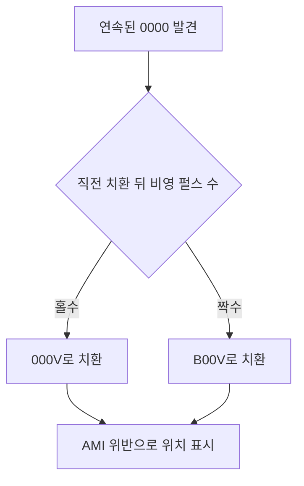

- 비영 펄스 수가 **홀수**: `000V`
- 비영 펄스 수가 **짝수**: `B00V`

이 규칙은 치환과 치환 사이의 비영 펄스 수를 짝수로 유지해 직류 균형을 지킨다. B8ZS보다 짧은 네 개의 0마다 치환하므로 긴 무신호 구간을 더 강하게 제한한다.

### 블록 코딩과 뒤섞기의 차이

| 구분 | 블록 코딩 | 뒤섞기 |
|---|---|---|
| 핵심 동작 | (m)비트를 더 긴 (n)비트로 변환 | 특정 긴 0 패턴을 특별한 신호 패턴으로 치환 |
| 비트 수 | 증가함 | 증가하지 않음 |
| 대표 방식 | 4B/5B, 8B/10B | B8ZS, HDB3 |
| 주된 목적 | 동기화, 제어 코드, 오류 검출 | AMI의 긴 0 동기화 문제 해결 |
| 적용 위치 | 회선 코딩 전에 수행 | 회선 코딩 규칙과 결합해 수행 |

---

# 4.2 아날로그 대 디지털 변환

> 교재 118~128쪽

음성, 음악, 온도처럼 원래 값이 연속적으로 변하는 정보는 아날로그 데이터이다. 이를 디지털 시스템에서 저장·처리·전송하려면 연속적인 값을 유한한 비트열로 바꾸어야 한다. 이 과정을 **디지털화(digitization)**라고 한다.

이 절은 두 방법을 다룬다.

- **PCM(Pulse Code Modulation)**: 일정 시점의 진폭값 자체를 측정해 비트로 표현
- **DM(Delta Modulation)**: 이전 값과 비교해 위로 갈지 아래로 갈지만 비트로 표현

## 4.2.1 펄스 코드 변조 (PCM)

PCM은 아날로그 신호를 디지털 데이터로 바꾸는 가장 널리 쓰이는 방식이다.

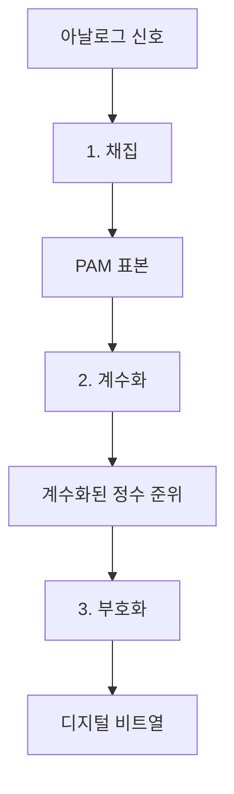

1. 아날로그 신호를 일정한 시간 간격으로 **채집(sampling)**한다.
2. 각 표본을 가장 가까운 유한한 진폭 준위로 **계수화(quantization)**한다.
3. 선택된 준위 번호를 이진 비트열로 **부호화(encoding)**한다.

이 세 단계에서 정보가 조금씩 바뀐다.

- 채집: 연속 시간 → 이산 시간
- 계수화: 연속 진폭 → 이산 진폭
- 부호화: 이산 진폭 번호 → 0과 1의 비트열

## 4.2.2 채집 (Sampling)

아날로그 신호를 매 (T_s)초마다 측정한다.

- (T_s): 채집 주기 또는 채집 간격, 단위는 초
- (f_s): 채집률 또는 채집 주파수, 단위는 samples/s 또는 Hz

둘은 서로 역수이다.

$$
f_s=\frac{1}{T_s}
$$

즉 (T_s)가 짧을수록 더 자주 측정하므로 (f_s)가 커진다.

### 세 가지 채집 방법

| 방법 | 동작 | 특징 |
|---|---|---|
| 이상적 채집 | 한 순간의 값만 점으로 취함 | 이론적으로 다루기 쉽지만 실제 펄스 폭을 0으로 만들 수 없음 |
| 자연적 채집 | 짧은 게이트가 열린 동안 원 신호 모양을 그대로 따라감 | 펄스 윗부분이 곡선이며 실제 구현 가능 |
| 꼭지치기 채집 | 채집 순간의 값을 짧은 구간 동안 일정하게 유지 | 표본-유지 회로로 구현하며 PCM에서 가장 흔함 |

채집 결과는 시간축에서는 펄스열이지만, 각 펄스의 높이가 여전히 연속적인 값을 가질 수 있다. 따라서 이 단계의 결과인 **PAM(Pulse Amplitude Modulation) 신호는 아직 아날로그 신호**이다. 디지털 데이터가 되려면 계수화와 부호화가 더 필요하다.

## 4.2.3 채집률과 나이퀴스트 정리

아날로그 파형을 너무 드물게 측정하면 서로 다른 원래 파형이 같은 표본들을 만들 수 있다. 그러면 수신기는 어느 파형이 원본인지 결정할 수 없다. 이것이 **앨리어싱(aliasing)**이다.

나이퀴스트 채집 정리는 대역 제한 아날로그 신호를 완전히 복원하기 위한 최소 조건을 다음처럼 제시한다.

$$
f_s\ge 2f_{max}
$$

- (f_s): 채집률
- (f_{max}): 원 신호에 포함된 가장 높은 주파수
- (2f_{max}): 나이퀴스트 채집률

### 왜 두 배인가?

가장 빠른 사인파 한 주기의 모양을 구별하려면 적어도 서로 다른 위치의 표본 두 개가 필요하다. 한 주기에 한 번만 측정하면 그 값이 커지는 중인지 작아지는 중인지, 혹은 더 느린 다른 파형인지 구별할 수 없다.

다만 “두 점이면 눈으로 파형이 예쁘게 그려진다”는 뜻은 아니다. 대역 제한이라는 조건과 이상적인 복원 필터가 있을 때, 전체 표본열의 수학적 관계로 원 신호를 복원할 수 있다는 뜻이다. 실무에서는 필터의 한계와 시계 오차 때문에 정확히 두 배보다 높은 채집률과 보호 여유를 둔다.

### 저대역 통과 신호와 대역 통과 신호

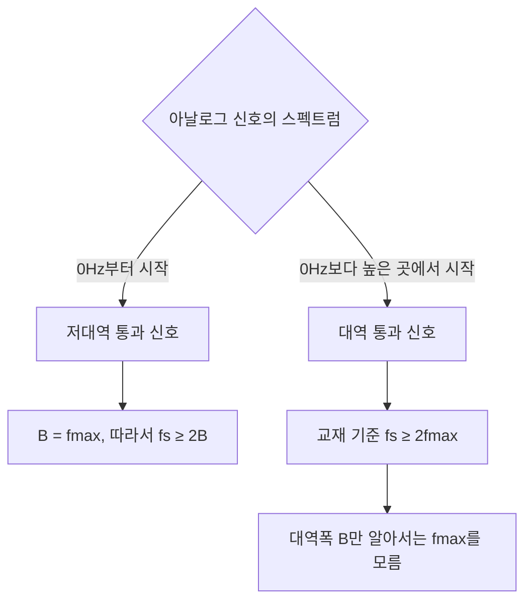

- 저대역 통과 신호가 0~$f_{max}$를 차지하면 대역폭 $B=f_{max}$이므로 $f_s\ge2B$이다.
- 대역 통과 신호가 (f_{min})~(f_{max})를 차지하면 대역폭은 (B=f_{max}-f_{min})이다. 교재의 기본 나이퀴스트 규칙에서는 (2f_{max})로 채집하므로, 대역폭만 알아서는 필요한 채집률을 정할 수 없다.

> 특정 조건에서는 대역 통과 표본화로 (2f_{max})보다 낮은 채집률을 쓸 수도 있지만, 이는 이 장의 기본 범위를 넘는다.

### 채집률에 따른 결과

- **나이퀴스트 채집** (f_s=2f_{max}): 이상적 조건에서 복원 가능한 최소 경계
- **과채집** (f_s>2f_{max}): 표본이 더 많아 복원과 필터 설계가 쉬워지지만 데이터량이 증가
- **저채집** (f_s<2f_{max}): 앨리어싱이 발생해 원 신호를 유일하게 복원할 수 없음

교재의 시계 비유에서 분침을 너무 드물게 사진 찍으면 시계가 앞으로 가는지 뒤로 가는지 혼동할 수 있다. 더 자주 찍으면 실제 이동 방향을 알 수 있다. 영화 속 바퀴가 거꾸로 도는 것처럼 보이는 현상도 같은 원리다.

### 교재 예제 정리

- 최대 주파수 4,000 Hz의 전화 음성: $f_s\ge 2\times4{,}000=8{,}000$ samples/s
- 0~200 kHz의 저대역 통과 신호: $f_s\ge400{,}000$ samples/s
- 대역폭만 200 kHz라고 알려진 대역 통과 신호: (f_{max})를 모르므로 교재의 최소 채집률을 결정할 수 없음

## 4.2.4 계수화 (Quantization)

채집 결과의 진폭은 여전히 무한히 많은 실수값을 가질 수 있다. 무한히 많은 값을 유한한 비트로 정확히 표현할 수 없으므로, 진폭 범위를 (L)개의 구간으로 나누고 각 표본을 가장 가까운 대표값으로 바꾼다.

### 균등 계수화 절차

1. 원 신호의 진폭 범위를 (V_{min})부터 (V_{max})까지로 정한다.
2. 전체 범위를 높이가 같은 (L)개 구간으로 나눈다.
3. 각 구간의 중간값을 계수화 대표값으로 정한다.
4. 표본이 속한 구간의 대표값으로 표본을 근사한다.

각 구간의 높이, 즉 계단 한 칸의 크기는 다음과 같다.

$$
\Delta=\frac{V_{max}-V_{min}}{L}
$$

- (Δ)가 작을수록 원래 표본을 더 정밀하게 근사한다.
- 같은 진폭 범위에서 (L)을 늘리면 (Δ)가 작아진다.
- 대신 더 많은 준위 번호를 표현해야 하므로 표본당 비트 수가 늘어난다.

### 계수화 준위 수와 표본당 비트 수

계수화 준위가 (L)개라면 각 준위를 구별하는 데 필요한 비트 수는

$$
n_b=\log_2L
$$

이다. 교재는 주로 (L)이 2의 거듭제곱인 경우를 가정한다.

| 계수화 준위 (L) | 표본당 비트 (n_b) |
|---:|---:|
| 2 | 1비트 |
| 4 | 2비트 |
| 8 | 3비트 |
| 16 | 4비트 |
| 256 | 8비트 |

$L$이 정확히 2의 거듭제곱이 아니라면 실제 고정 길이 이진 부호에는 $\lceil\log_2L\rceil$비트가 필요하다.

### 계수화 오차

실제 표본값과 선택된 대표값의 차이가 계수화 오차이다.

$$
e_q=V_{sample}-V_{quantized}
$$

표본이 허용 진폭 범위 안에 있고 각 구간의 중간값을 대표값으로 쓰면

$$
-\frac{\Delta}{2}\le e_q\le\frac{\Delta}{2}
$$

이다. 계수화는 근삿값을 만드는 비가역 과정이므로 이 오차를 수신기에서 완전히 없앨 수 없다. 계수화 오차는 신호에 더해진 잡음처럼 작용해 신호 대 잡음비를 낮춘다.

이상적인 균등 계수화기와 충분히 큰 정현파를 가정하면 계수화 SNR은 표본당 비트 수로 근사할 수 있다.

$$
SNR_{dB}\approx6.02n_b+1.76\text{ dB}
$$

비트 하나를 추가할 때마다 SNR이 약 6 dB 좋아진다. 이는 준위 수가 두 배가 되고 (Δ)가 절반이 되어 계수화 오차가 줄어들기 때문이다.

#### 교재 예제 4.12

8준위이면 $n_b=\log_2 8=3$이므로

$$
SNR_{dB}=6.02(3)+1.76=19.82\text{ dB}
$$

#### 교재 예제 4.13

전화 회선의 계수화 SNR이 최소 40 dB여야 한다면

$$
6.02n_b+1.76\ge40
$$

$$
n_b\ge\frac{40-1.76}{6.02}\approx6.35
$$

비트 수는 정수여야 하므로 최소 7비트가 필요하다. 실제 전화 PCM은 보통 표본당 7비트 또는 8비트를 사용한다고 교재는 설명한다.

### 균등 대 비균등 계수화

음성처럼 실제 신호의 진폭은 작은 값 근처에 더 자주 모일 수 있다. 모든 구간의 (Δ)를 똑같이 두면 작은 신호는 계단 한 칸의 변화가 상대적으로 너무 커져 오차가 두드러진다.

- **균등 계수화**: 모든 진폭 구간의 (Δ)가 같다.
- **비균등 계수화**: 작은 진폭 부근은 (Δ)를 작게, 큰 진폭 부근은 (Δ)를 크게 둔다.

비균등 계수화를 직접 만들기 어렵기 때문에 **컴팬딩(companding)**을 사용할 수 있다.

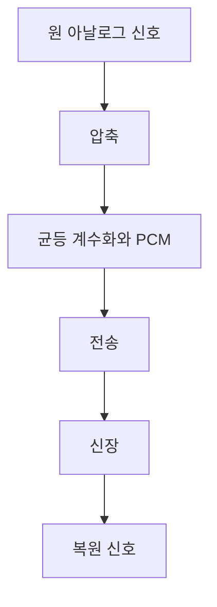

- 압축기(compressor): 큰 진폭의 간격을 줄여 상대적 비중을 낮춤
- 신장기(expander): 수신측에서 반대 변환으로 원래 진폭 관계를 복원
- 결과: 작은 진폭에 더 촘촘한 유효 계수화 간격을 배정해 음성 품질을 높임

## 4.2.5 부호화와 PCM 비트율

계수화가 끝나면 각 표본의 준위 번호를 (n_b)비트 이진수로 바꾼다. 초당 표본 수가 (f_s), 표본당 비트 수가 (n_b)이면 PCM 비트율은

$$
N=f_s\times n_b
$$

이다.

이 식이 나오는 이유는 단순하다.

```text
초당 표본 수 × 표본 하나를 표현하는 비트 수 = 초당 전체 비트 수
```

### 사람 음성 PCM 예제

- 음성의 최대 주파수: 4,000 Hz
- 나이퀴스트 채집률: $f_s=2\times4{,}000=8{,}000$ samples/s
- 표본당 비트 수: 8비트

$$
N=8{,}000\times8=64{,}000\text{ bit/s}=64\text{ kbps}
$$

따라서 전통적인 한 개 음성 PCM 채널의 대표 비트율이 64 kbps가 된다.

## 4.2.6 원래 신호의 복구

수신기의 PCM 복호기는 다음 순서로 아날로그 신호를 재구성한다.


1. 각 (n_b)비트 코드를 해당 계수화 준위로 바꾼다.
2. 표본값을 다음 표본 시점까지 유지해 계단형 신호를 만든다.
3. 원 신호의 최대 주파수에 맞춘 저대역 통과 필터로 계단의 고주파 성분을 제거한다.
4. 필요한 경우 증폭기로 최대·최소 진폭을 맞춘다.

채집률이 나이퀴스트 조건을 만족하고 계수화 준위가 충분하면 원래 파형에 가까운 신호를 얻을 수 있다. 다만 계수화 과정에서 버린 세부 진폭 정보는 되살릴 수 없다.

## 4.2.7 PCM 대역폭

아날로그 신호의 대역폭을 (B_{analog}), 표본당 비트 수를 (n_b)라고 하자. 저대역 통과 아날로그 신호를 나이퀴스트율로 채집하면

$$
f_s=2B_{analog}
$$

이고 PCM 비트율은

$$
N=f_sn_b=2B_{analog}n_b
$$

이다. 이 비트열을 회선 부호화할 때 최소 대역폭은

$$
B_{min}=c\times N\times\frac{1}{r}
$$

이므로 모두 연결하면

$$
B_{min}=c\times n_b\times2B_{analog}\times\frac{1}{r}
$$

이다.

NRZ 또는 양극형 신호처럼 (r=1), 평균 경우 (c=1/2)를 쓰면

$$
B_{min}=n_bB_{analog}
$$

이 된다.

즉, 표본당 (n_b)비트로 디지털화한 PCM 신호의 대표 최소 대역폭은 원 아날로그 신호 대역폭의 (n_b)배이다.

#### 교재 예제 4.15

- 원 아날로그 신호 대역폭: 4 kHz
- 표본당 비트 수: 8비트

$$
B_{min}=8\times4\text{ kHz}=32\text{ kHz}
$$

아날로그 그대로 보내면 최소 4 kHz가 필요하지만, 8비트 PCM으로 보내면 대표 최소 대역폭이 32 kHz가 된다. 디지털화는 잡음 내성, 저장·처리, 재생성 같은 이점을 주는 대신 더 큰 전송 대역폭을 요구할 수 있다.

## 4.2.8 채널의 최대 데이터율과 최소 요구 대역폭

잡음 없는 저대역 통과 채널의 대역폭이 (B), 한 신호 요소가 구별하는 신호 준위 수가 (L_s)라면 나이퀴스트 식은

$$
N_{max}=2B\log_2L_s
$$

이다.

이를 대역폭에 대해 정리하면

$$
B_{min}=\frac{N}{2\log_2L_s}
$$

이다.

### 왜 $L_s$를 늘리면 데이터율이 커지는가?

신호 준위가 2개면 한 신호 요소가 1비트만 표현한다.

$$
\log_2 2=1
$$

신호 준위가 4개면 각 준위에 `00, 01, 10, 11`을 배정해 한 신호 요소가 2비트를 표현한다.

$$
\log_2 4=2
$$

따라서 같은 초당 신호 요소 수로 더 많은 비트를 보낼 수 있다. 하지만 준위 간 간격이 좁아져 잡음에 취약해지므로 현실에서는 준위를 무한히 늘릴 수 없다.

### 두 종류의 $L$을 구별해야 한다

PCM 부분에서는 같은 문자 $L$이 서로 다른 맥락에 쓰일 수 있다. 혼동을 막기 위해 이 문서에서는 다음처럼 구분한다.

| 기호 | 의미 | 증가시키면 생기는 일 |
|---|---|---|
| $L_q$ | 계수화 준위 수 | 표본 진폭을 더 정밀하게 표현, $n_b=\log_2L_q$ 증가 |
| $L_s$ | 회선 신호 준위 수 | 한 신호 요소에 더 많은 비트를 담음, 잡음 판정은 어려워짐 |

교재는 문맥으로 둘을 구별하지만, 계산할 때는 어느 $L$인지 먼저 확인해야 한다.

## 4.2.9 델타 변조 (Delta Modulation, DM)

PCM은 매 표본의 절대 진폭을 여러 비트로 표현한다. DM은 더 단순하게 **직전 근삿값보다 원 신호가 위에 있는지 아래에 있는지**만 1비트로 보낸다.

### 기본 아이디어

- 현재 아날로그 값이 계단 근삿값보다 큼: 1 전송, 계단을 (δ)만큼 올림
- 현재 아날로그 값이 계단 근삿값보다 작음: 0 전송, 계단을 (δ)만큼 내림
- (δ): 매 채집 구간마다 움직이는 고정 계단 크기

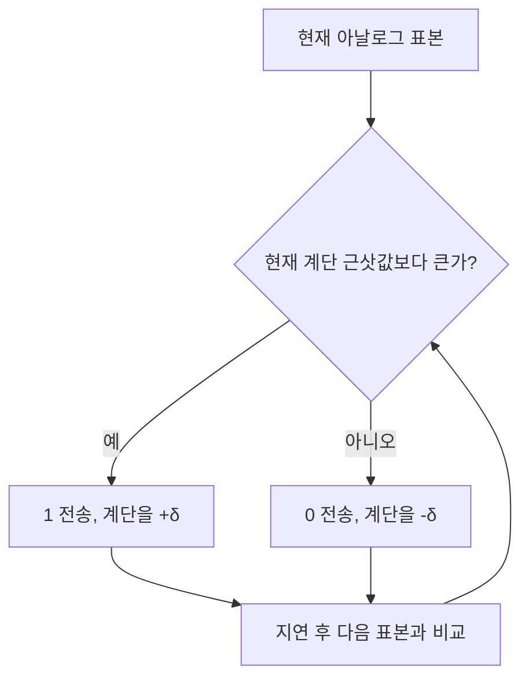

### 변조기

송신기의 비교기는 원 아날로그 값과 현재 계단 근삿값을 비교한다. 계단 발생기는 비교 결과에 따라 (+δ) 또는 (-δ)만큼 움직인다. 지연 장치는 한 채집 구간 동안 현재 계단값을 유지해 다음 비교의 기준으로 사용한다.

PCM처럼 표본의 진폭 번호 전체를 보내지 않고 방향만 보내므로 표본당 1비트만 필요하고 구현이 단순하다.

### 복조기

수신기는 받은 1과 0을 이용해 송신기와 같은 계단 신호를 다시 만든다.

- 1 수신: 계단을 (δ)만큼 올림
- 0 수신: 계단을 (δ)만큼 내림
- 저대역 통과 필터: 계단 모양을 부드러운 아날로그 파형으로 만듦

### DM의 오차와 적응 DM

고정 δ는 모든 상황에 완벽하지 않다.

- **기울기 과부하(Slope overload)**: 원 신호가 빠르게 변하는데 δ가 너무 작으면 계단이 원 신호를 따라가지 못함
- **입상 잡음(Granular noise)**: 원 신호가 거의 일정한데 δ가 너무 크면 계단이 원 신호 주변에서 위아래로 크게 흔들림

**적응 DM(Adaptive DM)**은 최근 비트 패턴과 신호 변화에 따라 δ를 조정한다.

- 같은 방향의 비트가 연속되면 빠른 변화로 보고 δ를 키운다.
- 방향이 자주 바뀌면 완만한 구간으로 보고 δ를 줄인다.

### PCM과 DM 비교

| 구분 | PCM | DM |
|---|---|---|
| 무엇을 보냄 | 각 표본의 절대 계수화 준위 | 이전 근삿값에서 상승/하강 방향 |
| 표본당 비트 | 보통 여러 비트 | 1비트 |
| 송수신 구조 | 채집·계수화·부호화 필요 | 비교기·계단 발생기 중심으로 단순 |
| 대표 오차 | 계수화 오차 | 기울기 과부하, 입상 잡음 |
| 특징 | 높은 품질과 정밀한 표현에 유리 | 단순하지만 충분히 빠른 채집과 적절한 δ가 중요 |

---

# 4.3 전송 방식

> 교재 128~132쪽

이제 비트와 신호를 만드는 방법은 정했다. 다음 질문은 **여러 비트를 몇 개의 선으로, 어떤 시간 규칙에 맞춰 보낼 것인가**이다.

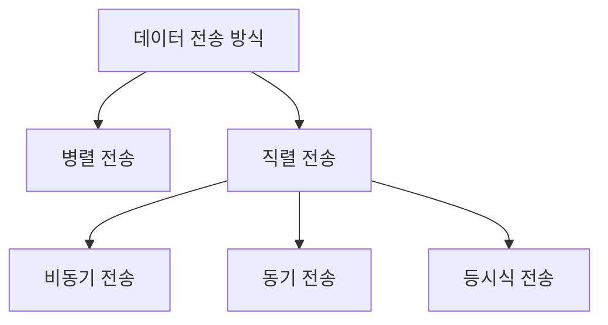

## 4.3.1 병렬 전송 (Parallel Transmission)

병렬 전송은 (n)비트를 동시에 보내기 위해 (n)개의 전선을 사용한다. 8비트를 한 번에 보내려면 일반적으로 8개의 데이터 선이 필요하다.

- 장점: 같은 클록 조건이라면 직렬 전송보다 이론상 (n)배 빠르게 한 묶음을 전달할 수 있다.
- 단점: 선, 커넥터 핀, 송수신 회로가 (n)배 가까이 필요해 비용이 크다.
- 거리 제한: 선마다 지연이 조금씩 달라지는 스큐(skew) 때문에 긴 거리에서는 동시에 보낸 비트가 동시에 도착하지 않을 수 있다.
- 대표 사용: 컴퓨터 내부 버스처럼 짧은 거리

병렬 전송의 핵심은 **시간을 줄이는 대신 공간, 즉 여러 선을 소비한다**는 것이다.

## 4.3.2 직렬 전송 (Serial Transmission)

직렬 전송은 한 비트를 다른 비트 뒤에 차례대로 보내며 하나의 통신 채널만 사용한다.

송신기에서는 병렬 데이터를 직렬 비트열로 바꾸고, 수신기에서는 다시 병렬 형태로 조립할 수 있다.


- 장점: 통신 선이 하나이므로 배선 비용이 병렬 방식의 약 (1/n)로 줄어든다.
- 단점처럼 보이는 점: 비트를 하나씩 보내야 한다.
- 실제 장거리 통신에서는 적은 선, 작은 커넥터, 선간 스큐 회피, 높은 직렬 클록 기술 때문에 직렬 방식이 일반적이다.

직렬 전송은 비동기, 동기, 등시식으로 나뉜다.

## 4.3.3 비동기 전송 (Asynchronous Transmission)

비동기 전송은 비트 하나하나의 타이밍이 아무렇게나 된다는 뜻이 아니다. **각 바이트 내부의 비트 시간은 일정하지만, 바이트와 다음 바이트 사이의 간격은 일정하지 않아도 된다.**

일반적인 8비트 데이터 바이트의 전송 구조는 다음과 같다.

```text
유휴 상태(1) ... 시작비트(0) + 데이터 8비트 + 정지비트(1 이상) ... 임의 간격
```

- 시작 비트: 보통 0, 새 바이트가 시작됨을 알림
- 데이터 비트: 보통 8개
- 정지 비트: 하나 이상의 1, 바이트가 끝났음을 알림
- 바이트 사이: 길이가 일정하지 않은 유휴 구간 가능

수신기는 시작 비트의 전이를 발견하면 자신의 타이머를 맞추고, 정해진 비트 시간마다 데이터 비트를 읽는다. 정지 비트를 확인한 뒤 다음 시작 비트를 기다린다.

### 왜 ‘비동기’인가?

- 바이트와 바이트 사이에는 공통 시계를 계속 맞출 필요가 없다.
- 하지만 한 바이트가 전송되는 동안에는 송신기와 수신기가 같은 비트 지속시간을 사용해야 한다.
- 따라서 정확한 표현은 **바이트 수준에서는 비동기, 비트 수준에서는 동기**이다.

### 오버헤드

8비트 데이터에 시작 1비트와 정지 1비트를 붙이면 최소 10비트를 보낸다.

$$
\text{효율}=\frac{8}{10}=80\%
$$

즉 최소 20%가 데이터가 아닌 제어 비트이다. 바이트 사이 유휴 시간까지 포함하면 실제 효율은 더 낮아질 수 있다. 대신 구조가 단순하고 키보드 입력이나 저속 터미널처럼 데이터가 불규칙하게 생기는 상황에 알맞다.

## 4.3.4 동기 전송 (Synchronous Transmission)

동기 전송은 여러 바이트를 긴 프레임으로 묶고, 프레임 내부에서는 시작 비트·정지 비트·바이트 사이 간격 없이 연속적인 비트열로 보낸다.

- 송신기는 긴 비트열을 연속 전송한다.
- 수신기는 비트열에서 클록을 복구해 비트 경계를 유지한다.
- 수신기가 비트를 바이트나 문자, 프레임으로 재구성한다.
- 전송할 데이터가 잠시 없을 때는 약속된 유휴 패턴을 보낼 수 있다.
- 프레임과 프레임 사이에는 간격이 있을 수 있지만, 프레임 내부 비트열은 연속적이다.

장점은 각 바이트마다 시작·정지 비트를 붙이지 않아 오버헤드가 작고 고속 전송에 적합하다는 것이다. 대신 수신기가 계속 정확한 비트 타이밍을 유지해야 하므로 동기화 회로와 프레임 경계 규칙이 필요하다.

## 4.3.5 등시식 전송 (Isochronous Transmission)

실시간 음성과 영상은 단순히 비트 순서가 맞는 것만으로 충분하지 않다. 데이터가 너무 늦거나 프레임 사이 간격이 들쭉날쭉하면 소리가 끊기고 영상이 흔들린다.

등시식 전송은 데이터가 **정해진 시간에 도착하도록 보장**하는 방식이다.

- 일정한 시간 간격 또는 허용 가능한 좁은 지연 범위를 유지한다.
- 전체 비트 스트림의 시간 관계가 중요하다.
- 실시간 음성, 영상, 주기적인 센서 스트림에 적합하다.

동기 전송이 “비트열을 끊김 없이 효율적으로 보내는 방법”에 초점을 둔다면, 등시식 전송은 “각 데이터가 재생 시점을 놓치지 않도록 도착 시간을 관리하는 방법”에 초점을 둔다.

### 전송 방식 비교

| 방식 | 선의 수 | 전송 단위와 간격 | 동기화 방식 | 장점 | 대표 한계·용도 |
|---|---:|---|---|---|---|
| 병렬 | (n)개 | (n)비트 동시 | 공통 클록 | 짧은 거리에서 빠름 | 비싸고 스큐 발생, 내부 버스 |
| 직렬 비동기 | 1개 | 바이트 단위, 바이트 사이 간격 가변 | 시작·정지 비트로 바이트마다 재동기화 | 단순, 불규칙한 저속 데이터에 적합 | 시작·정지 비트 오버헤드 |
| 직렬 동기 | 1개 | 긴 프레임, 내부 간격 없음 | 연속 비트열에서 클록 복구 | 높은 효율과 고속 전송 | 동기·프레임 경계 회로 필요 |
| 직렬 등시식 | 1개 | 시간 제약이 있는 연속 스트림 | 도착 시각·간격까지 관리 | 실시간 재생 품질 유지 | 시간 자원 예약·보장이 필요 |

---

# 4.4 추천도서

> 교재 133쪽

교재는 더 깊은 학습을 위해 장 끝의 참고문헌 기호를 사용한다. 아래 기호의 전체 서지정보는 교재 말미의 참고문헌에서 확인해야 한다.

- 디지털 대 디지털 변환: `[Pea92]` 7장, `[Cou01]` 3장, `[Sta04]` 5.1절
- 표본 채집: `[Pea92]` 15~18장, `[Cou01]` 3장, `[Sta04]` 5.3절, `[Hsu03]`
- 더 깊은 수학적 내용: `[Ber96]`

---

# 4.5 핵심용어

> 교재 133~134쪽의 핵심용어를 이 장의 의미에 맞춰 짧게 풀이했다.

| 용어 | 영어 | 이 장에서의 뜻 |
|---|---|---|
| 2B1Q 부호화 | 2B1Q encoding | 2비트를 1개의 4준위 신호 요소로 표현하는 다준위 부호 |
| 4B/5B 부호화 | 4B/5B encoding | 4비트를 전이가 충분한 5비트 코드로 바꾸는 블록 코딩 |
| 8B/10B 부호화 | 8B/10B encoding | 8비트를 직류 균형과 동기화를 고려한 10비트 코드로 바꾸는 방식 |
| 8B/6T 부호화 | 8B/6T encoding | 8비트를 6개의 3준위 신호 요소로 바꾸는 방식 |
| B8ZS | bipolar with 8-zero substitution | 연속된 0 여덟 개를 `000VB0VB`로 치환하는 AMI 뒤섞기 |
| HDB3 | high-density bipolar 3-zero | 연속된 0 네 개를 `000V` 또는 `B00V`로 치환하는 방식 |
| 가상전수 | pseudoternary | 1은 0V, 0은 교대 극성 펄스로 나타내는 양극형 부호 |
| 계수화 오차 | quantization error | 실제 표본과 선택된 계수화 대표값의 차이 |
| 교차 표식 반전 | alternate mark inversion, AMI | 1 펄스의 극성을 양·음으로 번갈아 바꾸는 부호 |
| 기준선 | baseline | 수신기가 신호 판정 기준으로 삼는 이동 평균값 |
| 기준선 표류 | baseline wandering | 긴 동일 준위 때문에 기준선이 움직여 판정이 어려워지는 현상 |
| 데이터 요소 | data element | 전달하려는 정보의 최소 단위, 보통 1비트 |
| 데이터율 | data rate | 초당 전달되는 데이터 요소 수, bps |
| 델타 변조 | delta modulation | 직전 근삿값에서 상승·하강 방향만 1비트로 보내는 방식 |
| 디지털 대 디지털 변환 | digital-to-digital conversion | 디지털 데이터를 디지털 신호로 표현하는 과정 |
| 디지털화 | digitization | 아날로그 데이터를 디지털 데이터로 바꾸는 과정 |
| 보오율 | baud rate | 초당 전송되는 신호 요소 수 |
| 비동기 전송 | asynchronous transmission | 바이트마다 시작·정지 비트로 독립 전송하는 직렬 방식 |
| 양극 부호화 | bipolar encoding | (+V,0,-V)를 사용하고 한 비트값의 극성을 교대하는 부호 |
| 변조율 | modulation rate | 신호율 또는 보오율의 다른 표현 |
| 다준위 이진 | multilevel binary | 여러 전압 준위로 한 신호 요소에 여러 비트를 담는 부호 |
| 비트 전송률 | bit rate | 초당 전송되는 비트 수 |
| 블록 부호화 | block coding | (m)비트 블록을 더 긴 (n)비트 블록으로 치환하는 방식 |
| 직류 성분 | DC component | 0Hz 부근에 집중된 신호 에너지 또는 평균 전압 성분 |
| 회선 부호화 | line coding | 비트열을 링크가 운반할 디지털 신호로 바꾸는 과정 |
| 맨체스터 부호화 | Manchester encoding | 비트 중간 전이로 데이터와 시계 정보를 함께 표현하는 부호 |
| 다중회선 3준위 | MLT-3 | 세 준위와 상태 전이 규칙으로 고주파 성분을 줄이는 부호 |
| 비영복귀 | nonreturn to zero, NRZ | 비트 중간에 0V로 돌아가지 않고 준위를 유지하는 방식 |
| 비영복귀 반전 | NRZ-I | 비트 시작점의 전이 여부로 비트를 나타내는 NRZ 방식 |
| 비영복귀 준위 | NRZ-L | 절대 전압 준위로 비트값을 나타내는 NRZ 방식 |
| 나이퀴스트 정리 | Nyquist theorem | 최고 주파수의 최소 두 배로 채집해야 복원 가능하다는 조건 |
| 병렬 전송 | parallel transmission | 여러 비트를 여러 선으로 동시에 보내는 방식 |
| 극 부호화 | polar encoding | 양과 음 두 전압 극성을 사용하는 회선 부호 |
| 펄스 진폭 변조 | pulse amplitude modulation, PAM | 표본값을 펄스 높이로 나타낸 채집 결과 |
| 펄스 코드 변조 | pulse code modulation, PCM | 채집·계수화·부호화로 아날로그를 비트열로 바꾸는 방식 |
| 펄스 전송률 | pulse rate | 초당 펄스 또는 신호 요소 수 |
| 계수화 | quantization | 연속 진폭 표본을 유한한 대표 준위로 근사하는 과정 |
| 영복귀 | return to zero, RZ | 각 비트 구간 안에서 신호가 0V로 돌아오는 방식 |
| 차분 맨체스터 | differential Manchester | 중간 전이는 동기화, 시작점 전이 여부는 데이터 판정에 쓰는 방식 |
| 채집 | sampling | 아날로그 신호를 일정한 시간 간격으로 측정하는 과정 |
| 채집률 | sampling rate | 1초당 표본 수 |
| 축약 및 신장 | companding and expanding | 송신 전 진폭을 압축하고 수신 후 반대로 확장하는 과정 |
| 자기 동기화 | self-synchronizing | 신호 전이 자체가 수신기 시계 조정 정보를 제공하는 성질 |
| 직렬 전송 | serial transmission | 한 채널로 비트를 차례대로 보내는 방식 |
| 신호 준위 | signal level | 신호 요소가 취할 수 있는 구별 가능한 전압·세기 상태 |
| 시작 비트 | start bit | 비동기 전송에서 바이트 시작을 알리는 비트, 보통 0 |
| 정지 비트 | stop bit | 비동기 전송에서 바이트 끝을 알리는 하나 이상의 1 |
| 동기 전송 | synchronous transmission | 시작·정지 비트 없이 긴 프레임을 연속 전송하는 방식 |
| 단극 부호화 | unipolar encoding | 시간축 한쪽의 전압만 사용하는 회선 부호 |

---

# 4.6 요약

> 교재 134~135쪽을 중심으로, 앞의 설명과 연결해 다시 정리했다.

1. 디지털 대 디지털 변환에는 회선 코딩, 블록 코딩, 뒤섞기가 있다.
2. 회선 코딩은 디지털 데이터를 디지털 신호로 바꾸는 필수 과정이다.
3. 데이터 요소는 정보의 최소 단위이고, 신호 요소는 이를 운반하는 신호의 최소 시간 단위이다.
4. 비트율 (N)과 보오율 (S)의 대표 관계는 (S=cN/r)이다.
5. 실제 디지털 신호의 전체 스펙트럼은 무한하지만, 전송에서 중요한 유효 대역폭은 유한하다.
6. 좋은 회선 부호는 기준선 표류와 직류 성분을 줄이고, 자기 동기화와 잡음 면역성을 제공해야 한다.
7. 회선 코딩은 단극형, 극형, 양극형, 다준위, 다중회선 방식으로 나뉜다.
8. 한 신호 요소에 더 많은 비트를 담으면 보오율과 대역폭을 줄일 수 있지만, 더 많은 준위를 판정해야 해 잡음과 회로 복잡도 문제가 커진다.
9. 블록 코딩은 (m)비트 그룹을 더 긴 (n)비트 그룹으로 바꿔 동기화와 일부 오류 검출 능력을 얻는다.
10. 뒤섞기는 비트 수를 늘리지 않고 AMI의 긴 0을 특별한 위반 패턴으로 치환한다. 대표 방식은 B8ZS와 HDB3이다.
11. 아날로그 대 디지털 변환의 대표 방식은 PCM이며 채집, 계수화, 부호화의 세 단계를 거친다.
12. 나이퀴스트 정리에 따르면 대역 제한 신호의 채집률은 최고 주파수의 최소 두 배여야 한다.
13. 계수화 준위가 $L_q$개이면 표본당 비트 수는 $n_b=\log_2L_q$이다.
14. PCM 비트율은 (N=f_sn_b)이고, 대표 최소 대역폭은 (B_{min}=n_bB_{analog})이다.
15. DM은 절대 진폭 대신 이전 근삿값에서 상승할지 하강할지만 1비트로 보낸다.
16. 병렬 전송은 여러 선으로 여러 비트를 동시에 보내며 빠르지만 비싸고 짧은 거리에 적합하다.
17. 직렬 전송은 한 채널로 비트를 차례대로 보내며 비동기, 동기, 등시식으로 나뉜다.
18. 비동기 전송은 각 바이트에 시작·정지 비트를 붙이고 바이트 사이 간격을 허용한다.
19. 동기 전송은 시작·정지 비트와 바이트 사이 간격 없이 긴 프레임을 연속 전송한다.
20. 등시식 전송은 실시간 데이터가 정해진 시각에 도착하도록 시간 관계를 보장한다.

---

# 4.7 연습문제 안내

> 첨부된 교재 135쪽에는 복습문제 1~12와 주관식문제 13~15가 보인다. 15번에 필요한 데이터 스트림과 이후 문제는 첨부 범위 밖에 있어 완전한 원문을 확인할 수 없다.

## 복습문제로 확인해야 할 내용

1. 디지털 대 디지털 변환의 세 기술
2. 데이터 요소와 신호 요소의 차이
3. 데이터율과 신호율의 차이
4. 기준선 표류가 디지털 전송에 미치는 영향
5. 직류 성분이 통신 시스템에 미치는 영향
6. 자기 동기화 신호의 특징
7. 회선 코딩의 다섯 범주
8. 블록 코딩의 정의와 목적
9. 뒤섞기의 정의와 목적
10. PCM과 DM의 비교
11. 병렬 전송과 직렬 전송의 차이
12. 직렬 전송의 세 방식

## 계산형 문제를 위한 점검식

| 무엇을 구하는가 | 사용할 식 |
|---|---|
| 평균 신호율 | $S=cN/r$ baud |
| 대표 최소 대역폭 | $B_{min}=cN/r$ Hz |
| 잡음 없는 채널 최대 비트율 | $N_{max}=2B\log_2L_s$ bps |
| 나이퀴스트 채집률 | $f_s\ge2f_{max}$ |
| 계수화 간격 | $\Delta=(V_{max}-V_{min})/L_q$ |
| 표본당 비트 수 | $n_b=\log_2L_q$ |
| 계수화 SNR | $SNR_{dB}\approx6.02n_b+1.76$ |
| PCM 비트율 | $N=f_sn_b$ |
| PCM 대표 최소 대역폭 | $B_{min}=n_bB_{analog}$ |

## 식을 고르는 순서

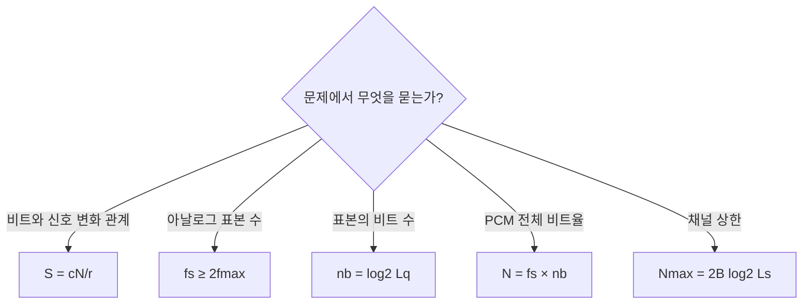

문제에서 같은 (L)이나 (N)을 보더라도 먼저 문맥을 확인해야 한다.

- (L_q): 계수화 준위인가?
- (L_s): 회선 신호 준위인가?
- (N): 원 데이터 비트율인가, 4B/5B 뒤에 증가한 비트율인가?
- (B): 원 아날로그 대역폭인가, 디지털 회선의 대역폭인가?

이 네 가지를 구분하면 Chapter 4 계산 문제의 대부분을 같은 흐름으로 풀 수 있다.

---

# 마지막 연결 정리

Chapter 4의 모든 내용은 다음 한 문장으로 연결된다.

> **정보를 비트로 만들고, 비트를 전송에 적합한 신호 변화로 바꾸며, 그 신호 변화를 제한된 수의 선과 제한된 대역폭 안에서 정확한 타이밍으로 전달하는 방법을 배우는 장이다.**

아날로그 음성을 예로 들면 전체 과정은 다음과 같다.

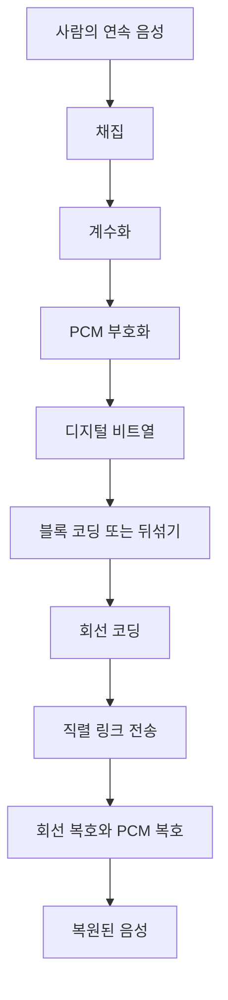

이 흐름에서 Chapter 3은 신호·주파수·대역폭의 성질을 설명했고, Chapter 4는 그 성질을 이용해 실제 데이터를 디지털 신호로 만드는 방법을 설명한다.
