# Chapter 3. Physical Layer: Signals and Transmission

---

# 0. 범위 및 다루는 계층

## 범위

이 장에서는 컴퓨터가 가지고 있는 데이터를 실제 통신 매체를 통해 전달하기 위해  
**어떻게 물리적인 신호로 표현하고 전송하는지**를 다룬다.

주요 내용은 다음과 같다.

- Analog Signal과 Digital Signal
- Periodic Signal과 Nonperiodic Signal
- Amplitude, Frequency, Period, Phase
- Frequency Domain
- Bandwidth와 Channel
- Bit Rate와 Symbol Rate
- Sampling과 Aliasing
- PCM
- Digital-to-Analog Modulation
  - ASK
  - FSK
  - PSK
  - QAM
- Analog-to-Analog Modulation
  - AM
  - FM
  - PM
- Multiplexing
  - FDM
  - TDM
- Spread Spectrum
  - FHSS
  - DSSS
- CDMA

---

## 다루는 계층

이 장의 중심은 **OSI 1계층인 Physical Layer**이다.

Physical Layer는 프레임이나 패킷의 의미를 해석하는 계층이 아니다.

상위 계층에서 만들어진 비트열을

- 전기 신호
- 전파
- 빛

과 같은 **실제 물리적인 신호로 표현하여 전송하는 것**이 핵심 역할이다.

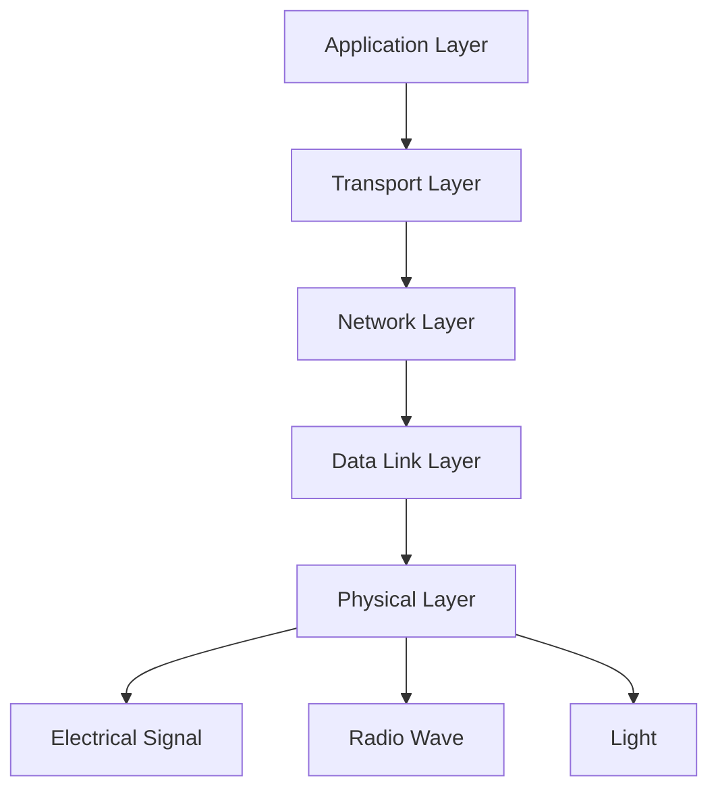

---

# 1. Chapter 3의 핵심 흐름

이 장을 이해할 때 가장 중요한 것은 각각의 용어를 따로 외우지 않는 것이다.

전체 과정은 다음과 같이 이어진다.

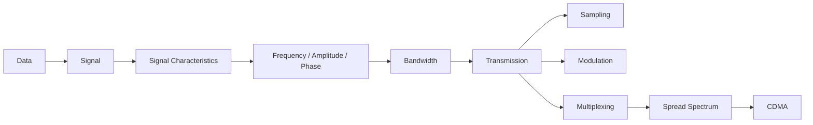

즉,

> **데이터를 보내려면 신호가 필요하고, 신호를 이해하려면 주파수와 진폭 같은 특성을 알아야 하며, 여러 주파수 성분을 사용하면 대역폭이라는 개념이 필요해진다.  
> 그리고 실제 통신에서는 신호를 디지털화하거나 변조하고, 여러 사용자가 하나의 통신 자원을 공유하기 위해 다중화와 확산 기술을 사용한다.**

---

# 2. Data와 Signal

먼저 **Data와 Signal은 같은 것이 아니다.**

## Data

Data는 전달하고 싶은 **정보의 내용**이다.

예를 들어

```text
10110101
```

이라는 비트열은 데이터다.

하지만 이 비트 자체가 구리선이나 공기 중을 그냥 이동할 수 있는 것은 아니다.

실제 통신 매체를 통해 전달하려면 이 데이터를 물리적인 형태로 표현해야 한다.

---

## Signal

Signal은 데이터를 전달하기 위해 사용하는 **물리적인 표현**이다.

예를 들어 구리선에서는 전압 변화를 이용할 수 있다.

```text
Data

1 0 1 1 0 1

↓

Electrical Signal

High Low High High Low High
```

무선 통신에서는 전압이 아니라 전자기파를 사용할 수 있고,  
광통신에서는 빛을 사용할 수 있다.

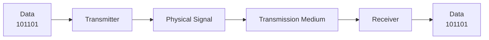

따라서 Physical Layer의 핵심은

> **데이터를 전송 가능한 신호로 바꾸고, 수신 측에서 다시 데이터를 얻어내는 것**

이라고 볼 수 있다.

---

# 3. Analog Signal과 Digital Signal

신호는 크게

- Analog Signal
- Digital Signal

로 구분할 수 있다.

---

## 3.1 Analog Signal

Analog Signal은 시간에 따라 값이 **연속적으로 변화하는 신호**이다.

즉 두 값 사이에 수많은 중간값을 가질 수 있다.

예를 들어 전압이

```text
0V → 0.1V → 0.2V → 0.3V → ...
```

처럼 연속적으로 변화할 수 있다.

대표적인 예는

- 사람의 음성
- 자연적인 소리
- 전파
- 온도 변화

등이다.

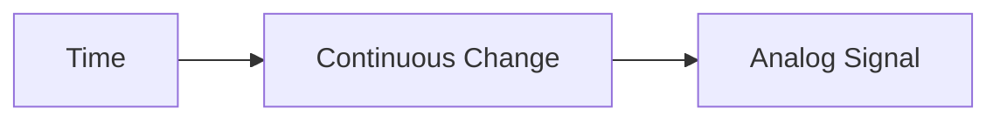

---

## 3.2 Digital Signal

Digital Signal은 가능한 신호 값이 **이산적으로 구분되는 신호**이다.

가장 대표적인 형태는 Binary Digital Signal이다.

예를 들어

```text
High Voltage = 1
Low Voltage  = 0
```

처럼 두 개의 상태를 사용한다.

중요한 점은

> Digital Signal에서 반드시 `1 = 어떤 고정 전압`, `0 = 반드시 0V`인 것은 아니다.

통신 방식에 따라 서로 다른 전압 범위를 사용할 수 있다.

예를 들어

```text
2V ~ 5V  → 1
0V ~ 1V  → 0
```

처럼 **전압 범위**를 가지고 판정할 수도 있다.

---

# 4. 왜 Digital Signal이 처리하기 쉬운가?

흔히

> Digital Signal은 Analog Signal보다 noise에 강하다.

라고 표현한다.

하지만 이것을 정확하게 이해해야 한다.

Digital Signal 자체가 noise의 영향을 받지 않는다는 뜻이 아니다.

Digital Signal 역시 전송 과정에서 noise의 영향을 받는다.

차이는 **수신기가 원래 값을 복원하는 방식**에 있다.

---

## Analog Signal

원래 신호가

```text
2.37 V
```

였는데 Noise가 섞여

```text
2.19 V
```

가 되었다면 수신기는 원래 값이 정확히 2.37V였는지 알기 어렵다.

즉 아날로그에서는 파형 자체의 왜곡이 정보 왜곡으로 이어질 수 있다.

---

## Digital Signal

Digital Signal은 상태만 구분할 수 있으면 된다.

예를 들어

```text
0V ~ 1V = 0

4V ~ 5V = 1
```

이라고 정의했다고 생각해 보자.

원래 5V였던 신호가 Noise 때문에 4.6V가 되어도

```text
4.6V → 여전히 1
```

이라고 판단할 수 있다.

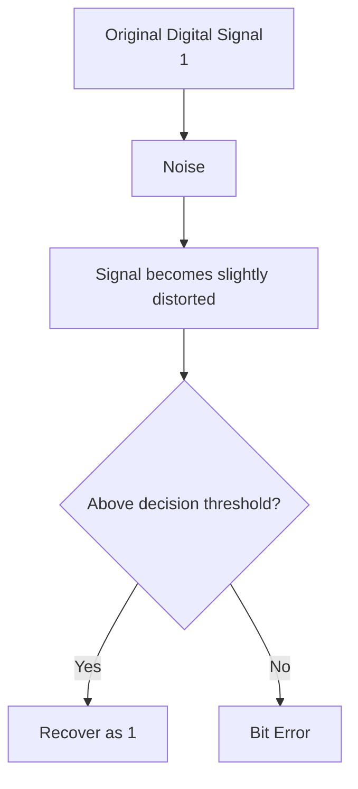

따라서 디지털 신호가 noise에 강하다는 말은 정확하게는

> **Noise가 어느 정도 존재하더라도 수신기가 임계값을 이용하여 원래의 이산적인 상태를 다시 판정할 수 있기 때문이다.**

라는 의미이다.

Noise가 너무 커서 임계값을 넘어가 버리면 Digital Signal에서도 Bit Error가 발생한다.

---

# 5. Periodic Signal과 Nonperiodic Signal

신호는 반복 여부에 따라서도 구분한다.

---

## 5.1 Periodic Signal

Periodic Signal은 일정한 시간마다 동일한 형태가 반복되는 신호이다.

예를 들어

```text
~ ∿ ~ ∿ ~ ∿ ~
```

처럼 일정한 패턴이 반복된다.

하나의 반복이 끝나고 다시 같은 형태가 나타나는 데 걸리는 시간을 **Period**라고 한다.

---

## 5.2 Nonperiodic Signal

Nonperiodic Signal은 일정한 시간 간격으로 동일한 패턴이 반복되지 않는 신호이다.

실제 데이터 통신에서 전달되는 데이터는 대부분 완벽한 주기적 신호가 아니다.

왜냐하면 사용자가 전송하는 데이터가

```text
1010101010...
```

처럼 영원히 같은 패턴을 반복하는 것이 아니기 때문이다.

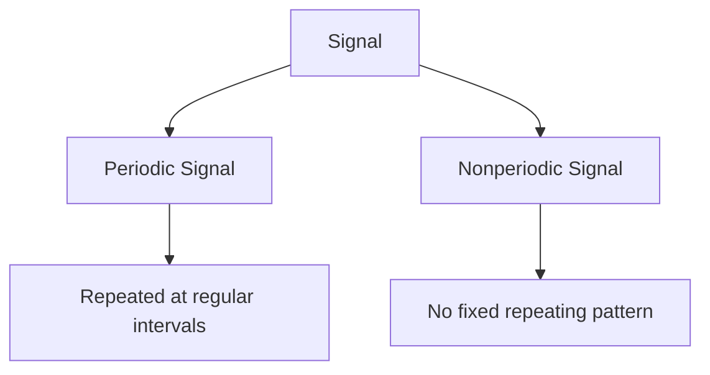

---

# 6. Sine Wave

주기적인 아날로그 신호를 이해할 때 가장 기본이 되는 것이 **Sine Wave**이다.

Sine Wave는 크게 세 가지 특성으로 설명한다.

- Amplitude
- Frequency
- Phase

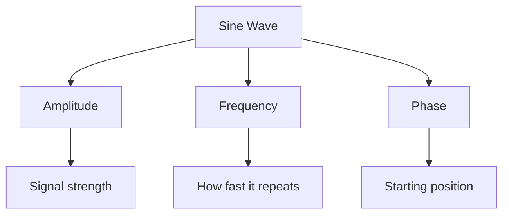

---

# 7. Amplitude

Amplitude는 신호의 **크기**를 나타낸다.

전기 신호라면 전압의 크기가 될 수 있고,  
전자기파에서는 전기장 또는 자기장의 크기와 관련된다.

쉽게 말하면

> **파형이 얼마나 크게 움직이는가**

를 나타낸다.

```text
높은 Amplitude

        /\
       /  \
------/----\------
     /      \


낮은 Amplitude

      /\
-----/--\-----
```

Amplitude가 커졌다고 해서 반드시 더 많은 데이터를 보내는 것은 아니다.

Amplitude는 기본적으로 **신호의 세기**와 관련된 개념이다.

---

# 8. Period

Period는 신호가 **한 번 반복되는 데 필요한 시간**이다.

기호는 보통

```text
T
```

를 사용한다.

예를 들어 하나의 파형이 반복되는 데

```text
0.5 second
```

가 필요하다면

```text
T = 0.5 s
```

이다.

---

# 9. Frequency

Frequency는 신호가 **1초에 몇 번 반복되는지**를 나타낸다.

단위는

```text
Hz
```

이다.

예를 들어

```text
1초 동안 10번 반복
```

된다면

```text
10 Hz
```

이다.

Period와 Frequency는 서로 역수 관계이다.

```text
f = 1 / T

T = 1 / f
```

예를 들어

```text
T = 0.5 s
```

라면

```text
f = 1 / 0.5
  = 2 Hz
```

이다.

---

## Frequency가 높다는 의미

Frequency가 높다는 것은 **신호가 더 빠르게 반복된다는 것**이다.

```text
Low Frequency

     /        \        /
----/----------\------/----

High Frequency

  /\  /\  /\  /\  /\
-/--\/--\/--\/--\/--\-
```

따라서 동일한 시간 동안 High Frequency 신호가 더 많이 진동한다.

---

## 매우 중요한 주의점

> **주파수가 높다고 무조건 더 많은 정보를 보낼 수 있는 것은 아니다.**

Carrier Frequency 자체와 Data Rate는 같은 개념이 아니다.

예를 들어

```text
Carrier = 2.4 GHz
```

라고 해서

```text
2.4 Gbit/s
```

의 데이터를 보낼 수 있다는 뜻은 아니다.

실제 데이터 전송률에 더 직접적인 영향을 주는 것은

- 사용할 수 있는 Bandwidth
- SNR
- Modulation 방식
- Symbol Rate

등이다.

즉

> **높은 중심 주파수 ≠ 높은 데이터 전송률**

이다.

---

# 10. Phase

Phase는 하나의 주기적인 신호가 **주기 중 어느 위치에서 시작하는지**를 나타낸다.

예를 들어 같은 Frequency와 같은 Amplitude를 가지고 있어도 시작 위치가 다를 수 있다.

```text
Signal A

    /\
---/--\----


Signal B

------/\----
     /  \
```

두 신호는 Frequency와 Amplitude는 같지만 Phase가 다르다.

이 특성은 뒤에서 설명할 **PSK**에서 데이터를 표현하기 위해 사용된다.

---

# 11. Time Domain과 Frequency Domain

신호를 보는 방법에는 크게 두 가지가 있다.

## Time Domain

시간에 따라서 신호가 어떻게 변하는지 보는 방법이다.

```text
Amplitude
   |
   |    /\
   |   /  \
   |__/____\________ Time
```

가로축은 **Time**이고 세로축은 **Amplitude**이다.

---

## Frequency Domain

신호가 어떤 주파수 성분으로 이루어져 있는지를 보는 방법이다.

```text
Amplitude
   |
   |    |
   |    |      |
   |____|______|______ Frequency
       f1     f2
```

가로축은 **Frequency**이고 세로축은 각 주파수 성분의 **Amplitude**이다.

---

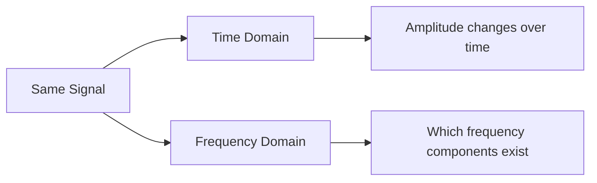

---

# 12. Composite Signal

실제 통신 신호는 하나의 Sine Wave만으로 구성되는 경우보다  
**여러 Frequency를 가진 Sine Wave가 합쳐진 형태**인 경우가 많다.

이를 Composite Signal이라고 한다.

예를 들어

```text
100 Hz
+
200 Hz
+
300 Hz
```

의 신호가 합쳐져 하나의 복잡한 신호를 만들 수 있다.

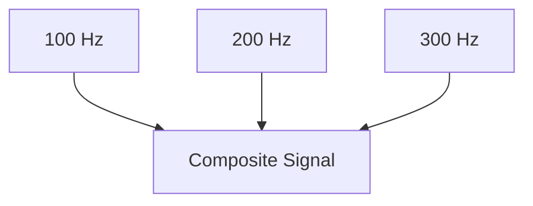

이 개념이 중요한 이유가 있다.

여러 Frequency를 사용하기 시작하면

> **이 신호가 도대체 어느 정도의 Frequency 범위를 차지하는가?**

라는 질문이 생긴다.

여기서 **Bandwidth**가 등장한다.

---

# 13. Bandwidth

Bandwidth는 신호 또는 채널이 사용하는 **주파수 범위의 폭**이다.

가장 기본적인 정의는

```text
Bandwidth = Highest Frequency - Lowest Frequency
```

이다.

즉

```text
B = fH - fL
```

이다.

---

## 예시

어떤 신호가

```text
1000 Hz ~ 5000 Hz
```

까지의 Frequency를 사용한다면

```text
Bandwidth
= 5000 - 1000
= 4000 Hz
```

이다.

따라서

```text
Frequency Range = 1000 ~ 5000 Hz
Bandwidth       = 4000 Hz
```

이다.

---

# 14. Frequency와 Bandwidth의 차이

이 둘을 반드시 구분해야 한다.

## Frequency

하나의 주파수가 **어디에 위치하는지**를 나타낸다.

예:

```text
2.4 GHz
```

---

## Bandwidth

사용하는 Frequency 범위가 **얼마나 넓은지**를 나타낸다.

예:

```text
2.400 GHz ~ 2.420 GHz
```

라면

```text
Bandwidth = 20 MHz
```

이다.


즉 Frequency가 위치라면 Bandwidth는 **폭**이다.

---

# 15. Channel

Channel은 통신을 위해 사용하도록 할당된 **전송 자원 또는 주파수 영역**을 의미한다.

Frequency 관점에서는

> 전체 Spectrum 중 특정 통신을 위해 나누어 놓은 주파수 구간

이라고 이해할 수 있다.

예를 들어 전체 사용 가능한 범위가

```text
100 MHz ~ 200 MHz
```

라면 이를

```text
Channel 1
Channel 2
Channel 3
Channel 4
```

처럼 여러 구간으로 나눌 수 있다.

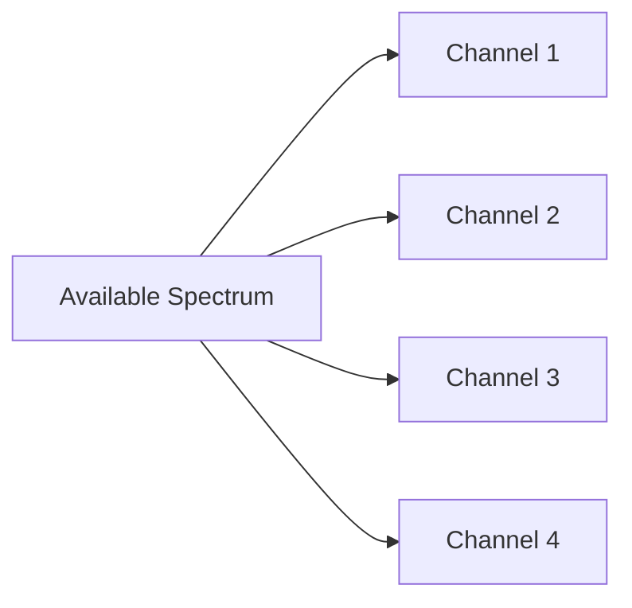

---

# 16. Frequency / Channel / Bandwidth 관계

세 개념을 다음처럼 생각하면 가장 쉽다.

```text
Frequency
= 주파수축 위의 위치

Channel
= 통신을 위해 할당한 주파수 구간

Bandwidth
= 그 구간의 폭
```

예를 들어

```text
Channel A = 100 MHz ~ 110 MHz
```

라면

```text
Lower Frequency = 100 MHz
Upper Frequency = 110 MHz

Bandwidth = 10 MHz
```

이다.

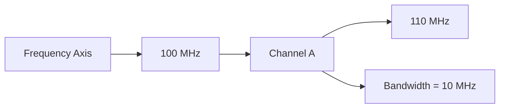

---

# 17. 왜 Bandwidth가 크면 일반적으로 Data Rate가 증가하는가?

이 부분에서 가장 흔한 오해가 있다.

> Bandwidth가 크면 주파수가 빠르기 때문에 데이터를 많이 보낸다.

라고 이해하면 정확하지 않다.

Bandwidth가 크다는 것은

> **신호를 표현하는 데 사용할 수 있는 주파수 성분의 범위가 더 넓다**

는 뜻이다.

넓은 Bandwidth를 이용하면 신호를 더 빠르게 변화시킬 수 있고,  
그 결과 일정 시간 동안 더 많은 Symbol을 구분하여 전송할 가능성이 커진다.

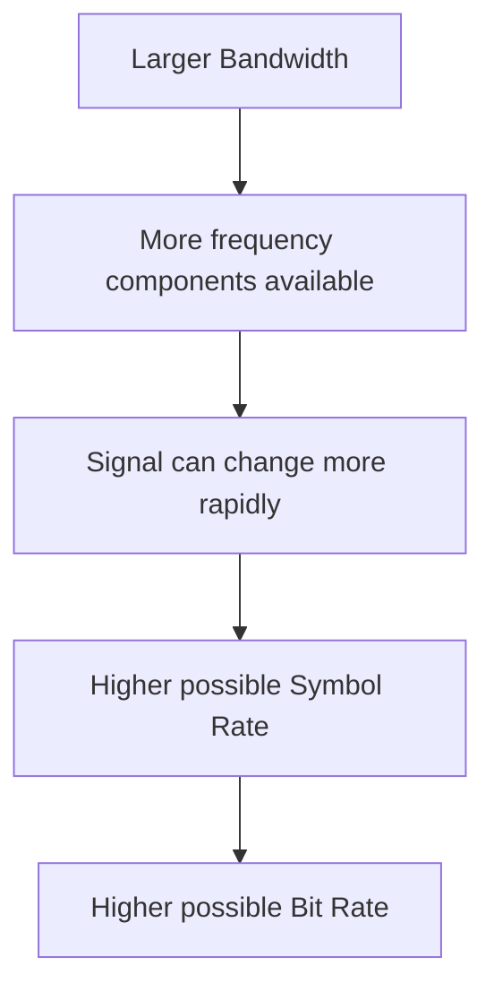

단,

> **Bandwidth만으로 실제 Data Rate가 결정되는 것은 아니다.**

Noise와 Modulation 방식 등의 조건도 함께 고려해야 한다.

---

# 18. Bit Rate

Bit Rate는

> **1초 동안 몇 개의 Bit를 전송하는가**

를 나타낸다.

단위는

```text
bps
```

이다.

예를 들어

```text
1초 동안 1000 bit
```

를 전송하면

```text
1000 bps
```

이다.

---

# 19. Symbol과 Symbol Rate

여기서 중요한 개념이 하나 더 등장한다.

실제 신호는 반드시

```text
한 번 변화 = 1 bit
```

로 동작할 필요가 없다.

하나의 신호 상태가 여러 Bit를 표현할 수 있다.

이 신호 상태를 **Symbol**이라고 한다.

---

## 2개의 Symbol

```text
Symbol A = 0
Symbol B = 1
```

이면 하나의 Symbol이 1 bit를 표현한다.

---

## 4개의 Symbol

```text
Symbol A = 00
Symbol B = 01
Symbol C = 10
Symbol D = 11
```

이면 하나의 Symbol이 2 bit를 표현한다.

---

## 8개의 Symbol

8개의 상태가 있다면

```text
000
001
010
011
100
101
110
111
```

과 같이 하나의 Symbol로 3 bit를 표현할 수 있다.

따라서

```text
Bits per Symbol = log2(M)
```

이다.

여기서 `M`은 가능한 Symbol의 개수이다.

그리고

```text
Bit Rate = Symbol Rate × Bits per Symbol
```

이다.

즉

```text
Rb = Rs × log2(M)
```

으로 볼 수 있다.

---

# 20. Sampling

지금까지 신호의 특징을 살펴봤다면 이제 문제가 하나 생긴다.

사람의 음성과 같은 자연적인 신호는 Analog Signal이다.

하지만 컴퓨터는 Digital Data를 처리하는 것이 편하다.

따라서

> **Analog Signal을 Digital Data로 바꾸는 과정**

이 필요하다.

그 첫 번째 단계가 **Sampling**이다.

---

## Sampling의 의미

Sampling은

> Analog Signal을 일정한 시간 간격으로 측정하는 것

이다.

```text
Analog Signal

      /\
     /  \
----/----\------


Sampling

      ●
     / \
  ● /   \ ●
---●-----●------
```

연속적인 모든 값을 저장하는 것이 아니라  
일정한 시간마다 값을 측정한다.

---

# 21. Sampling Frequency

1초에 몇 번 Sampling하는지를 Sampling Frequency라고 한다.

단위는

```text
samples/s
```

또는 Hz를 사용한다.

예를 들어

```text
1초에 8000번 Sampling
```

한다면

```text
Sampling Frequency = 8 kHz
```

이다.

---

# 22. Nyquist Sampling Theorem

Sampling을 너무 적게 하면 원래 신호를 제대로 복원할 수 없다.

따라서 Band-limited Signal을 정확하게 복원하려면 일반적으로

```text
fs >= 2 × fmax
```

가 되어야 한다.

여기서

```text
fs   = Sampling Frequency
fmax = 원래 신호에 포함된 가장 높은 Frequency
```

이다.

---

## 예시: 사람이 들을 수 있는 소리

사람의 가청 주파수 범위를 대략

```text
20 Hz ~ 20 kHz
```

라고 한다.

가장 높은 주파수는

```text
20 kHz
```

이다.

따라서 최소 Sampling Frequency는

```text
2 × 20 kHz
= 40 kHz
```

이상이어야 한다.

중요한 것은

```text
40 Hz ~ 40 kHz를 Sampling한다
```

가 아니다.

Sampling Frequency가 40 kHz라는 뜻은

> **1초에 40,000번 신호를 측정한다**

는 뜻이다.

---

# 23. Aliasing

Nyquist 조건보다 낮은 Sampling Frequency를 사용하면  
서로 다른 Frequency가 같은 것처럼 보일 수 있다.

이를 **Aliasing**이라고 한다.

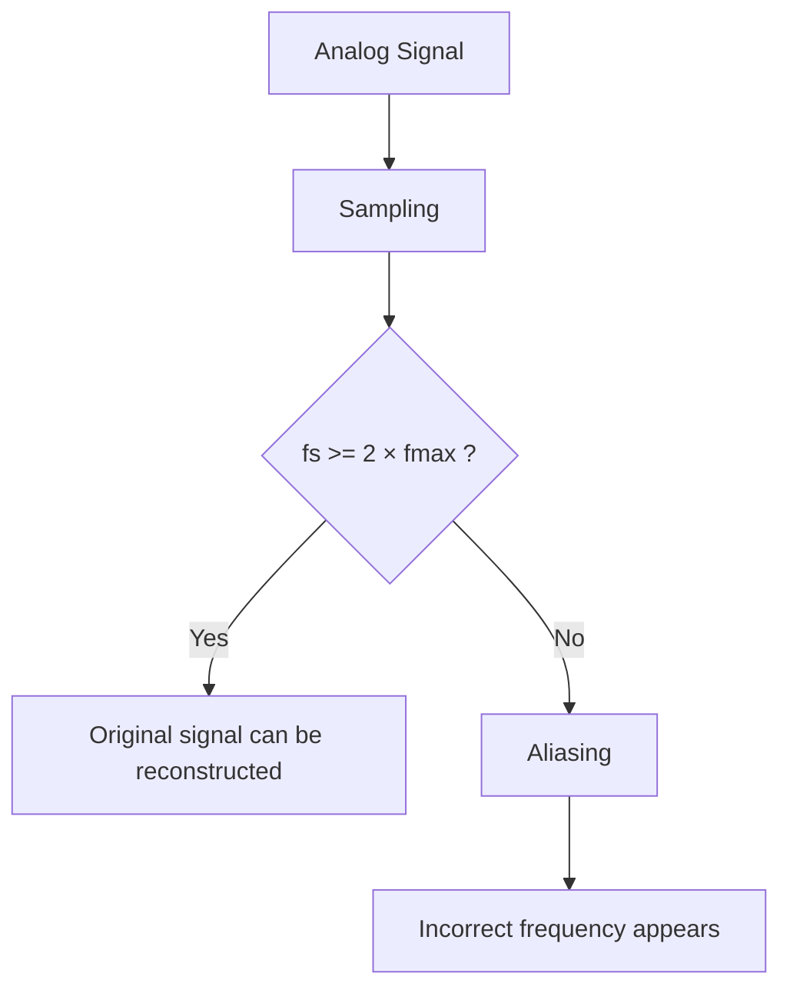

즉 Sampling을 너무 느리게 하면 수신 측에서는

> 실제로는 빠르게 움직이는 신호를 더 느린 신호로 잘못 판단할 수 있다.

---

# 24. Quantization

Sampling을 하면 각 시점에서 Analog 값이 나온다.

예를 들어

```text
1.17 V
2.83 V
3.46 V
```

처럼 연속적인 값이다.

하지만 Digital System에서는 무한히 많은 실수 값을 그대로 표현하기 어렵다.

따라서 값을 일정한 단계로 나눈다.

이 과정이 **Quantization**이다.

예를 들어

```text
0 ~ 1V → Level 0
1 ~ 2V → Level 1
2 ~ 3V → Level 2
3 ~ 4V → Level 3
```

과 같이 가장 가까운 단계로 값을 대응시킨다.

---

# 25. Encoding

Quantization을 통해 만들어진 Level을 Binary 값으로 바꾼다.

예를 들어 4개의 Level을 사용한다면

```text
Level 0 → 00
Level 1 → 01
Level 2 → 10
Level 3 → 11
```

처럼 표현할 수 있다.

---

# 26. PCM

PCM은 **Pulse Code Modulation**이다.

Analog Signal을 Digital Data로 만드는 대표적인 방법이다.

전체 과정은

```text
Sampling
→ Quantization
→ Encoding
```

이다.

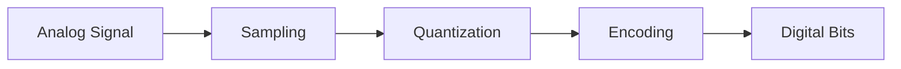

정리하면

### Sampling

```text
언제 측정할 것인가?
```

### Quantization

```text
측정값을 어느 Level로 표현할 것인가?
```

### Encoding

```text
그 Level을 어떤 Binary 값으로 표현할 것인가?
```

이다.

---

# 27. Modulation이 필요한 이유

여기까지는 데이터를 Digital Signal로 표현하는 방법을 살펴봤다.

그런데 모든 통신 매체가 Baseband Digital Signal을 그대로 전달하기 적합한 것은 아니다.

특히 무선 통신에서는 특정 주파수의 전자기파를 만들어 데이터를 실어 보내야 한다.

이때 사용하는 것이 **Carrier Signal**이다.

Carrier Signal은 데이터를 전달하기 위한 기본적인 주기 신호이다.

송신자는 Carrier Signal의 특정 특성을 변화시켜 데이터를 표현한다.

이를 **Modulation**이라고 한다.

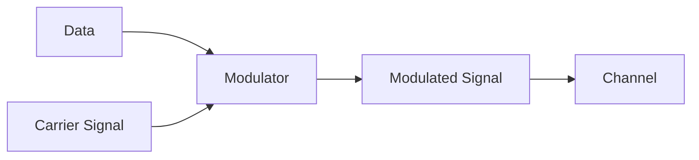

---

# 28. Carrier의 어떤 특성을 바꿀 수 있는가?

Sine Wave에는

- Amplitude
- Frequency
- Phase

가 있었다.

따라서 Carrier Signal에서도 이 세 특성을 바꾸어 데이터를 표현할 수 있다.

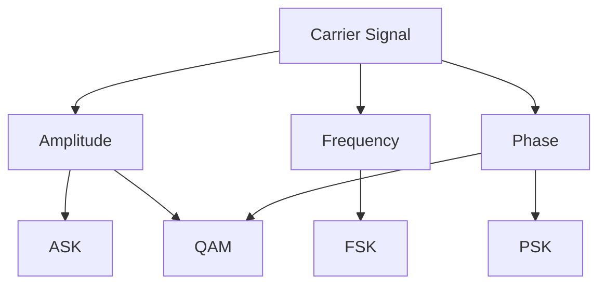

---

# 29. ASK

ASK는 **Amplitude Shift Keying**이다.

Carrier Signal의 **Amplitude를 변화시켜 Digital Data를 표현**한다.

예를 들어

```text
1 = High Amplitude
0 = Low Amplitude
```

또는

```text
1 = Carrier 존재
0 = Carrier 없음
```

으로 표현할 수 있다.

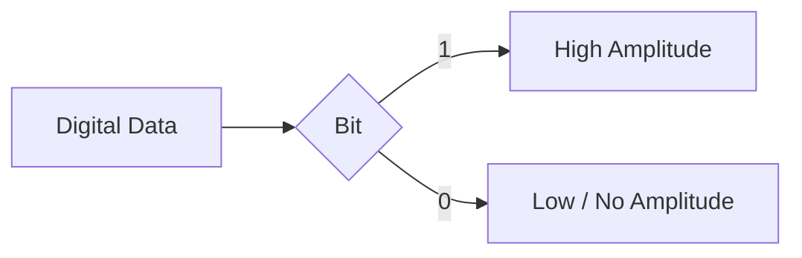

---

## ASK의 특징

장점은 구현이 비교적 단순하다는 것이다.

하지만 Amplitude를 이용하기 때문에

> Noise에 의해 신호 크기가 변하면 데이터 판정에 영향을 받을 수 있다.

따라서 Amplitude Noise에 상대적으로 민감할 수 있다.

---

# 30. FSK

FSK는 **Frequency Shift Keying**이다.

Carrier의 Frequency를 바꾸어 Digital Data를 표현한다.

예를 들어

```text
0 = f1
1 = f2
```

로 표현한다.

```text
0 → 낮은 Frequency

1 → 높은 Frequency
```

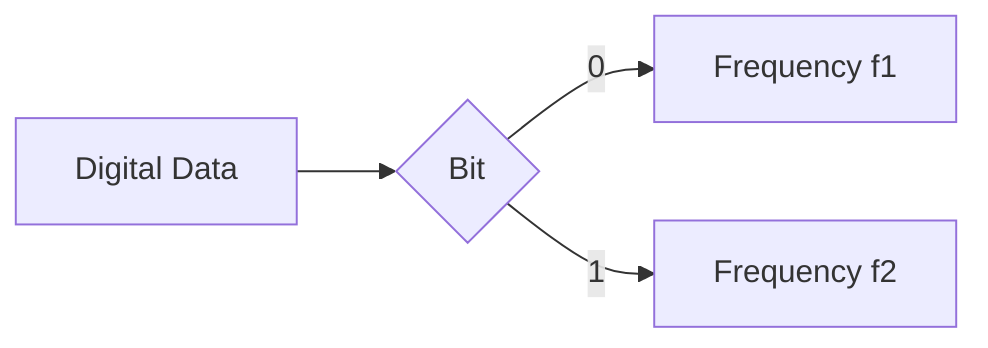

따라서 수신기는

> 들어온 신호가 어느 Frequency를 사용하는지

를 판별하여 0과 1을 복원한다.

---

# 31. PSK

PSK는 **Phase Shift Keying**이다.

Carrier의 Phase를 변화시켜 데이터를 표현한다.

가장 단순한 BPSK에서는 두 개의 서로 다른 Phase를 사용한다.

예를 들어

```text
0 → 0°
1 → 180°
```

처럼 표현할 수 있다.

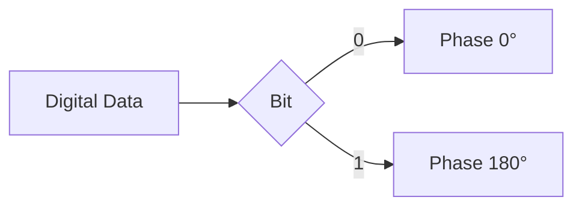

---

# 32. Higher-order PSK

Phase를 두 개만 사용할 필요는 없다.

예를 들어 QPSK에서는 네 개의 Phase를 사용할 수 있다.

```text
00
01
10
11
```

네 개의 Symbol을 만들 수 있으므로 하나의 Symbol로 2 bit를 표현한다.

```mermaid
flowchart TD
    A["QPSK"] --> B["Phase 1 → 00"]
    A --> C["Phase 2 → 01"]
    A --> D["Phase 3 → 10"]
    A --> E["Phase 4 → 11"]
```

따라서 동일한 Symbol Rate에서 BPSK보다 더 많은 Bit를 전송할 수 있다.

---

# 33. PSK의 한계

그러면 계속 Phase를 세밀하게 나누면 무한히 많은 데이터를 보낼 수 있을까?

그렇지 않다.

Phase 상태가 많아질수록 서로의 간격이 가까워진다.

```text
2개 Phase

0° ---------------- 180°


8개 Phase

0° 45° 90° 135° 180° 225° 270° 315°
```

Noise나 Phase Error가 발생하면  
수신기가 어느 Symbol이었는지 구분하기 어려워진다.

즉

> Symbol 수를 늘리면 한 Symbol당 더 많은 Bit를 표현할 수 있지만 Symbol 간 구분은 어려워진다.

---

# 34. QAM

QAM은 **Quadrature Amplitude Modulation**이다.

QAM은 Carrier의

- Amplitude
- Phase

를 함께 사용하여 여러 Symbol을 표현한다.

PSK가 주로 Phase 차이를 이용한다면 QAM은 두 가지 특성을 함께 사용한다.

```mermaid
flowchart TD
    A["QAM"] --> B["Amplitude"]
    A --> C["Phase"]
    B --> D["Many possible symbols"]
    C --> D
```

---

## 예시: 16-QAM

16개의 Symbol을 사용한다면

```text
log2(16) = 4
```

이므로 하나의 Symbol이 4 bit를 표현할 수 있다.

예를 들어

```text
0000
0001
0010
...
1111
```

을 각각 서로 다른 Amplitude와 Phase 조합에 대응시킨다.

---

# 35. Constellation Diagram

PSK와 QAM은 **Constellation Diagram**으로 표현할 수 있다.

각 점 하나가 하나의 Symbol이다.

가로축과 세로축은 일반적으로

```text
I = In-phase component
Q = Quadrature component
```

를 나타낸다.

점 사이의 거리가 충분히 멀면 Noise가 조금 생겨도 Symbol을 구분하기 쉽다.

반대로 점이 많아져 서로 가까워지면 더 많은 Bit를 표현할 수 있지만  
Noise에 의한 오류 가능성이 증가한다.

```mermaid
flowchart TD
    A["More Constellation Points"] --> B["More bits per symbol"]
    A --> C["Points become closer"]
    C --> D["More sensitive to noise"]
```

---

# 36. ASK / FSK / PSK / QAM 비교

| 방식 | 변화시키는 요소 | 핵심 아이디어 |
|---|---|---|
| ASK | Amplitude | 신호 크기로 데이터 표현 |
| FSK | Frequency | 주파수 차이로 데이터 표현 |
| PSK | Phase | 위상 차이로 데이터 표현 |
| QAM | Amplitude + Phase | 진폭과 위상을 함께 사용 |

```mermaid
flowchart TD
    A["Digital-to-Analog Modulation"] --> B["ASK<br/>Amplitude"]
    A --> C["FSK<br/>Frequency"]
    A --> D["PSK<br/>Phase"]
    A --> E["QAM<br/>Amplitude + Phase"]
```

---

# 37. Analog-to-Analog Modulation

지금까지는 Digital Data를 Analog Carrier에 실어 보내는 방법이었다.

하지만 원래 Data 자체가 Analog일 수도 있다.

예를 들어

```text
Voice
Music
Analog sensor signal
```

등이다.

이러한 Analog Signal을 다른 Analog Carrier에 실어 보내는 것을  
**Analog-to-Analog Modulation**이라고 한다.

대표적인 방식은

- AM
- FM
- PM

이다.

---

# 38. AM

AM은 **Amplitude Modulation**이다.

정보를 가지고 있는 원래 Analog Signal에 따라  
Carrier의 **Amplitude를 변화**시킨다.

```mermaid
flowchart LR
    A["Analog Message Signal"] --> B["AM Modulator"]
    C["Carrier"] --> B
    B --> D["Carrier Amplitude Changes"]
```

즉

```text
원래 정보 값이 커짐
→ Carrier Amplitude 증가

원래 정보 값이 작아짐
→ Carrier Amplitude 감소
```

와 같은 방식이다.

---

# 39. FM

FM은 **Frequency Modulation**이다.

원래 Analog Signal의 값에 따라 Carrier의 **Frequency를 변화**시킨다.

```mermaid
flowchart LR
    A["Analog Message Signal"] --> B["FM Modulator"]
    C["Carrier"] --> B
    B --> D["Carrier Frequency Changes"]
```

즉 Carrier 자체는 계속 존재하지만  
정보 값에 따라 순간적인 Frequency가 변한다.

---

# 40. PM

PM은 **Phase Modulation**이다.

원래 Analog Signal에 따라 Carrier의 **Phase를 변화**시킨다.

```mermaid
flowchart LR
    A["Analog Message Signal"] --> B["PM Modulator"]
    C["Carrier"] --> B
    B --> D["Carrier Phase Changes"]
```

---

# 41. Digital Modulation과 Analog Modulation 구분

이름이 비슷해서 헷갈리기 쉽다.

예를 들어

```text
ASK
```

와

```text
AM
```

은 둘 다 Amplitude를 변경한다.

하지만 입력 데이터가 다르다.

### ASK

```text
Digital Data
→ Carrier Amplitude 변경
```

### AM

```text
Analog Data
→ Carrier Amplitude 변경
```

마찬가지로

```text
FSK ↔ FM

PSK ↔ PM
```

의 관계로 이해할 수 있다.

```mermaid
flowchart TD
    A["Modulation"] --> B["Digital Data"]
    A --> C["Analog Data"]

    B --> D["ASK"]
    B --> E["FSK"]
    B --> F["PSK"]
    B --> G["QAM"]

    C --> H["AM"]
    C --> I["FM"]
    C --> J["PM"]
```

---

# 42. 하나의 통신 채널을 여러 사용자가 쓰려면?

지금까지는 한 송신자가 하나의 Channel을 사용하는 상황을 생각했다.

하지만 실제 네트워크에서는 하나의 물리적인 통신 자원을 여러 사용자가 공유해야 한다.

예를 들어 하나의 케이블이나 무선 주파수 범위를

```text
User A
User B
User C
User D
```

가 동시에 사용해야 할 수 있다.

여기서 등장하는 것이 **Multiplexing**이다.

---

# 43. Multiplexing

Multiplexing은

> 여러 개의 독립적인 신호 또는 데이터 흐름을 하나의 공유된 전송 매체를 통해 함께 전달하기 위한 기술

이다.

```mermaid
flowchart LR
    A["User A"] --> E["Multiplexer"]
    B["User B"] --> E
    C["User C"] --> E
    D["User D"] --> E

    E --> F["Shared Link"]

    F --> G["Demultiplexer"]

    G --> H["User A"]
    G --> I["User B"]
    G --> J["User C"]
    G --> K["User D"]
```

대표적으로

- FDM
- TDM

이 있다.

---

# 44. FDM

FDM은 **Frequency Division Multiplexing**이다.

전체 사용 가능한 Spectrum을 여러 개의 서로 다른 Frequency Channel로 나눈다.

```text
전체 Frequency Spectrum

|---- A ----|---- B ----|---- C ----|---- D ----|
```

각 사용자는 서로 다른 Frequency 영역을 사용한다.

```mermaid
flowchart TD
    A["Available Frequency Spectrum"] --> B["Channel A"]
    A --> C["Channel B"]
    A --> D["Channel C"]
    A --> E["Channel D"]

    B --> F["User A"]
    C --> G["User B"]
    D --> H["User C"]
    E --> I["User D"]
```

---

# 45. '주파수로 나눈다'는 정확히 무슨 뜻인가?

이 표현에서 자주 혼란이 생긴다.

FDM에서 주파수로 나눈다는 것은

> 하나의 Frequency 값을 여러 조각으로 나눈다는 의미가 아니다.

전체 사용 가능한 **Frequency Range**, 즉 Spectrum을 여러 구간으로 나누는 것이다.

예를 들어

```text
전체 범위
100 MHz ~ 140 MHz
```

가 있다면

```text
User A → 100 ~ 110 MHz
User B → 110 ~ 120 MHz
User C → 120 ~ 130 MHz
User D → 130 ~ 140 MHz
```

처럼 배정할 수 있다.

각 구간 하나가 Channel이다.

각 Channel의 폭이 그 Channel의 Bandwidth가 된다.

---

# 46. Guard Band

실제 FDM에서는 Channel을 완전히 붙여놓지 않는 경우가 많다.

Channel 사이에 작은 Frequency 간격을 둔다.

이를 **Guard Band**라고 한다.

```text
Channel A | Guard | Channel B | Guard | Channel C
```

Guard Band가 필요한 이유는 실제 신호가 이상적으로 특정 범위에서 정확히 끊어지지 않기 때문이다.

Channel들이 지나치게 가까우면 인접 Channel 사이에 Interference가 발생할 수 있다.

```mermaid
flowchart LR
    A["Channel A"] --- B["Guard Band"]
    B --- C["Channel B"]
    C --- D["Guard Band"]
    D --- E["Channel C"]
```

---

# 47. FDM의 한계

FDM에서는 각 사용자에게 특정 Frequency Band를 고정적으로 할당할 수 있다.

이 경우 사용자가 데이터를 보내지 않더라도 해당 Frequency Band가 예약되어 있다면  
다른 사용자가 그 Band를 사용하지 못한다.

```text
A : 사용 중
B : 사용 안 함
C : 사용 중
```

이어도

```text
| A Data | B Empty | C Data |
```

처럼 B의 Frequency Band는 비어 있을 수 있다.

따라서

> **정적으로 Frequency를 할당하면 사용하지 않는 Channel도 Bandwidth를 점유하는 비효율이 발생할 수 있다.**

---

# 48. TDM

TDM은 **Time Division Multiplexing**이다.

FDM이 Frequency를 나누었다면 TDM은 **시간을 나눈다.**

```text
Time →

| A | B | C | A | B | C | A | B | C |
```

각 사용자는 동일한 링크를 사용하지만 서로 다른 시간 구간에 전송한다.

이 시간 구간을 **Time Slot**이라고 한다.

```mermaid
flowchart LR
    A["Shared Channel"] --> B["Time Slot A"]
    B --> C["Time Slot B"]
    C --> D["Time Slot C"]
    D --> E["Time Slot A"]
```

---

# 49. FDM과 TDM 비교

## FDM

```text
같은 시간
+
서로 다른 Frequency
```

## TDM

```text
같은 Frequency 자원
+
서로 다른 Time
```

```mermaid
flowchart TD
    A["Multiplexing"] --> B["FDM"]
    A --> C["TDM"]

    B --> D["Divide Frequency"]
    D --> E["Users can transmit at the same time"]

    C --> F["Divide Time"]
    F --> G["Users transmit in different time slots"]
```

| 항목 | FDM | TDM |
|---|---|---|
| 분리 기준 | Frequency | Time |
| 사용자 구분 | 서로 다른 주파수 대역 | 서로 다른 시간 슬롯 |
| 동시에 송신 | 가능 | 슬롯 기준으로 분리 |
| 주요 낭비 | 비어 있는 Frequency Channel | 비어 있는 Time Slot |

---

# 50. Spread Spectrum

FDM처럼 사용자의 Frequency를 좁은 Channel로 정확히 분리하는 것과 다른 접근도 있다.

하나의 신호를 원래 필요한 것보다 **더 넓은 Frequency Band에 퍼뜨려서 전송**하는 방법이다.

이를 **Spread Spectrum**이라고 한다.

```mermaid
flowchart LR
    A["Original Data Signal"] --> B["Spreading"]
    B --> C["Wideband Signal"]
```

Spread Spectrum의 목적에는

- 간섭에 대한 강인성
- 특정 형태의 Jamming에 대한 저항성
- 여러 사용자 공유
- 신호 구분

등이 있다.

대표적으로

- FHSS
- DSSS

가 있다.

---

# 51. FHSS

FHSS는 **Frequency Hopping Spread Spectrum**이다.

송신 Frequency를 일정한 규칙에 따라 계속 변경한다.

예를 들어

```text
Time 1 → f3
Time 2 → f1
Time 3 → f4
Time 4 → f2
```

처럼 이동한다.

```mermaid
flowchart LR
    A["Time 1<br/>f3"] --> B["Time 2<br/>f1"]
    B --> C["Time 3<br/>f4"]
    C --> D["Time 4<br/>f2"]
```

송신자와 수신자는 동일한 Hopping Pattern을 알고 있어야 한다.

---

# 52. DSSS

DSSS는 **Direct Sequence Spread Spectrum**이다.

하나의 Data Bit를 바로 전송하지 않고  
더 빠르게 변화하는 **Chip Sequence**와 결합하여 전송한다.

예를 들어

```text
Data Bit = 1

Chip Code = +1 -1 +1 +1 -1
```

이라면 하나의 Bit가 여러 Chip으로 표현된다.

```mermaid
flowchart LR
    A["1 Data Bit"] --> B["Spread Code"]
    B --> C["Many Chips"]
    C --> D["Wideband Signal"]
```

---

# 53. Chip이란?

Chip은 Spread Spectrum에서 사용하는 더 짧은 신호 단위이다.

예를 들어

```text
1 bit
```

을

```text
8 chips
```

로 확산할 수 있다.

그러면

```text
Bit Rate = 1 Mbps

8 chips / bit
```

일 경우

```text
Chip Rate = 8 Mcps
```

가 된다.

즉

```text
Chip Rate > Bit Rate
```

이다.

---

# 54. 왜 Chip Rate가 높으면 Bandwidth가 증가하는가?

이 부분이 중요하다.

하나의 Bit를 전송하는 시간 동안 여러 Chip을 보내야 한다.

예를 들어

```text
원래 데이터

|       1       |       0       |
```

였는데 DSSS를 사용하면

```text
| + - + + - + - + | - + - - + - + - |
```

처럼 훨씬 빠르게 신호가 변화한다.

신호가 시간 영역에서 빠르게 변하려면 더 높은 Frequency 성분이 필요하다.

따라서

```mermaid
flowchart TD
    A["1 Bit"] --> B["Converted into multiple Chips"]
    B --> C["Chip Rate increases"]
    C --> D["Signal changes faster"]
    D --> E["More frequency components required"]
    E --> F["Occupied Bandwidth increases"]
```

즉

> **코드를 따로 하나 더 보내기 때문에 Bandwidth가 증가하는 것이 아니다.**

정확한 이유는

> **Spread Code와 결합된 결과 신호의 Chip Rate가 원래 Data Bit Rate보다 높아지고, 더 빠르게 변화하는 신호를 전송하기 위해 더 넓은 Bandwidth가 필요하기 때문이다.**

---

# 55. CDMA

CDMA는 **Code Division Multiple Access**이다.

FDM은 사용자를 Frequency로 분리했고

TDM은 사용자를 Time으로 분리했다.

CDMA는 사용자를 **Code로 구분한다.**

```mermaid
flowchart TD
    A["Multiple Access"] --> B["FDMA"]
    A --> C["TDMA"]
    A --> D["CDMA"]

    B --> E["Different Frequency"]
    C --> F["Different Time"]
    D --> G["Different Code"]
```

CDMA에서는 여러 사용자가 같은 시간과 같은 넓은 Frequency Band를 함께 사용할 수 있다.

대신 각 사용자에게 서로 다른 Code를 부여한다.

---

# 56. CDMA 송신 과정

예를 들어 User A에게 Code A가 할당되어 있다고 생각해 보자.

송신하려는 Data와 사용자의 Code를 결합한다.

개념적으로는

```text
User Data × User Code
```

형태로 이해할 수 있다.

```mermaid
flowchart LR
    A["User A Data"] --> C["Multiply / Combine"]
    B["User A Code"] --> C
    C --> D["Spread Signal A"]
```

User B도 마찬가지로 자신의 Code를 사용한다.

```mermaid
flowchart LR
    A["User B Data"] --> C["Multiply / Combine"]
    B["User B Code"] --> C
    C --> D["Spread Signal B"]
```

각 사용자의 Spread Signal은 동일한 Channel 위에서 더해져 전송될 수 있다.

---

# 57. CDMA 수신 과정

수신자는 전체 신호를 받는다.

이 신호에는 여러 사용자의 신호가 섞여 있다.

수신자는 자신이 원하는 사용자의 Code와 Received Signal을 연산한다.

```mermaid
flowchart LR
    A["Mixed Received Signal"] --> C["Correlation"]
    B["Desired User Code"] --> C
    C --> D["Desired User Data"]
```

Code가 적절하게 설계되어 있다면

```text
원하는 User Code
```

와의 Correlation은 크게 나타나고

```text
다른 User Code
```

와의 Correlation은 작거나 이상적으로 상쇄된다.

이를 이용하여 원하는 사용자의 Data를 추출한다.

---

# 58. CDMA에서 매우 중요한 오해

다음 설명은 정확하지 않다.

> 데이터를 보내고 Code도 별도로 보내기 때문에 필요한 Channel이 늘어난다.

CDMA에서 Spread Code를 별도 데이터 Channel에 따로 보내는 것이 핵심이 아니다.

송신자는 Data를 Code와 **결합하여 하나의 Spread Signal**을 만든다.

```text
Data
+
Code
↓
Spread Signal
```

따라서 Bandwidth가 커지는 핵심 이유는

```text
Code를 별도로 전송해서
```

가 아니라

```text
Chip Rate가 높아져 신호가 더 빠르게 변화하기 때문
```

이다.

---

# 59. CDMA와 DSSS의 관계

DSSS는 신호를 Code를 이용하여 넓은 Bandwidth로 확산하는 기술이다.

CDMA는 이러한 Code를 사용자 구분에도 활용한다.

개념적으로 보면

```mermaid
flowchart TD
    A["DSSS"] --> B["Data × Spreading Code"]
    B --> C["Wideband Spread Signal"]

    C --> D["Different users use different codes"]
    D --> E["CDMA"]
```

즉 DSSS는 **어떻게 신호를 확산하는가**에 초점이 있고

CDMA는

> **서로 다른 Code를 이용하여 여러 사용자가 동일한 통신 자원을 어떻게 공유하는가**

에 초점이 있다.

---

# 60. FDMA / TDMA / CDMA 비교

## FDMA

```text
User A → Frequency A
User B → Frequency B
User C → Frequency C
```

같은 시간에 송신할 수 있지만 서로 Frequency가 다르다.

---

## TDMA

```text
Time 1 → User A
Time 2 → User B
Time 3 → User C
```

같은 Channel을 사용하지만 송신 시간이 다르다.

---

## CDMA

```text
User A → Code A
User B → Code B
User C → Code C
```

같은 시간과 같은 넓은 Frequency Band를 사용할 수 있지만 Code가 다르다.

```mermaid
flowchart TD
    A["How to separate users?"] --> B["FDMA"]
    A --> C["TDMA"]
    A --> D["CDMA"]

    B --> E["Frequency"]
    C --> F["Time"]
    D --> G["Code"]
```

| 방식 | 사용자 구분 기준 |
|---|---|
| FDMA | Frequency |
| TDMA | Time |
| CDMA | Code |

---

# 61. Chapter 3 전체 흐름 다시 연결하기

이제 Chapter 3의 내용을 처음부터 하나의 흐름으로 연결할 수 있다.

컴퓨터는 데이터를 가지고 있다.

하지만 데이터 자체가 통신 매체를 이동할 수는 없다.

따라서 데이터를 **Signal**로 표현해야 한다.

```mermaid
flowchart TD
    A["Data"] --> B["Signal"]
```

Signal은 Analog 또는 Digital 형태로 나타날 수 있다.

```mermaid
flowchart TD
    A["Signal"] --> B["Analog"]
    A --> C["Digital"]
```

Signal을 분석하려면

```text
Amplitude
Frequency
Phase
```

와 같은 특성을 알아야 한다.

```mermaid
flowchart TD
    A["Signal"] --> B["Amplitude"]
    A --> C["Frequency"]
    A --> D["Phase"]
```

실제 Signal은 여러 Frequency 성분으로 이루어질 수 있기 때문에  
그 신호가 차지하는 Frequency 범위인 **Bandwidth**가 중요해진다.

```mermaid
flowchart LR
    A["Multiple Frequency Components"] --> B["Frequency Range"]
    B --> C["Bandwidth"]
```

Analog Signal을 Digital Data로 바꾸려면

```text
Sampling
→ Quantization
→ Encoding
```

과정을 사용할 수 있다.

```mermaid
flowchart LR
    A["Analog Signal"] --> B["Sampling"]
    B --> C["Quantization"]
    C --> D["Encoding"]
    D --> E["Digital Data"]
```

Digital Data를 Bandpass Channel에 보내기 위해서는 Carrier를 변조할 수 있다.

```mermaid
flowchart TD
    A["Digital Data"] --> B["ASK"]
    A --> C["FSK"]
    A --> D["PSK"]
    A --> E["QAM"]
```

Analog Data 역시 Carrier를 이용하여 변조할 수 있다.

```mermaid
flowchart TD
    A["Analog Data"] --> B["AM"]
    A --> C["FM"]
    A --> D["PM"]
```

하나의 통신 자원을 여러 사용자가 공유하기 위해 Multiplexing 또는 Multiple Access 기술을 사용한다.

```mermaid
flowchart TD
    A["Shared Communication Resource"] --> B["Frequency Division"]
    A --> C["Time Division"]
    A --> D["Code Division"]

    B --> E["FDM / FDMA"]
    C --> F["TDM / TDMA"]
    D --> G["CDMA"]
```

그리고 Spread Spectrum에서는 신호를 더 넓은 Frequency Range로 확산한다.

```mermaid
flowchart TD
    A["Spread Spectrum"] --> B["FHSS"]
    A --> C["DSSS"]

    B --> D["Change Frequency over time"]
    C --> E["Data × Spreading Code"]
    E --> F["High Chip Rate"]
    F --> G["Wide Bandwidth"]
    G --> H["CDMA"]
```

---

# 62. Chapter 3 최종 개념 지도

```mermaid
flowchart TD
    A["Physical Layer"] --> B["Signal"]

    B --> C["Analog Signal"]
    B --> D["Digital Signal"]

    B --> E["Signal Characteristics"]

    E --> F["Amplitude"]
    E --> G["Frequency"]
    E --> H["Phase"]

    G --> I["Period"]
    G --> J["Frequency Domain"]

    J --> K["Composite Signal"]
    K --> L["Bandwidth"]

    L --> M["Channel"]

    C --> N["Analog-to-Digital"]
    N --> O["Sampling"]
    O --> P["Quantization"]
    P --> Q["Encoding"]
    Q --> R["PCM"]

    D --> S["Digital-to-Analog Modulation"]

    S --> T["ASK"]
    S --> U["FSK"]
    S --> V["PSK"]
    S --> W["QAM"]

    C --> X["Analog-to-Analog Modulation"]

    X --> Y["AM"]
    X --> Z["FM"]
    X --> AA["PM"]

    M --> AB["Resource Sharing"]

    AB --> AC["FDM"]
    AB --> AD["TDM"]
    AB --> AE["Spread Spectrum"]

    AE --> AF["FHSS"]
    AE --> AG["DSSS"]

    AG --> AH["Chip"]
    AH --> AI["Chip Rate"]
    AI --> AJ["Wide Bandwidth"]
    AJ --> AK["CDMA"]
```

---

# 63. 시험 / 발표에서 반드시 잡아야 할 Reading Point

## 1. Data와 Signal은 다르다.

```text
Data = 전달하려는 정보

Signal = 그 정보를 매체를 통해 전달하기 위한 물리적인 표현
```

---

## 2. Analog와 Digital의 핵심 차이는 연속성이다.

```text
Analog
= 연속적인 값을 가짐

Digital
= 이산적인 상태를 사용
```

Digital Signal이 Noise에 비교적 강한 이유는  
파형 전체를 정확히 복원하는 대신 **상태를 다시 판정할 수 있기 때문**이다.

---

## 3. Frequency는 반복 속도이다.

```text
Frequency
= 1초 동안 몇 번 반복되는가
```

```text
f = 1 / T
```

---

## 4. 높은 Frequency와 높은 Data Rate는 같은 말이 아니다.

```text
High Carrier Frequency
≠
High Bit Rate
```

Data Rate에는 Bandwidth, SNR, Modulation 등이 함께 영향을 준다.

---

## 5. Bandwidth는 Frequency 범위의 폭이다.

```text
B = fH - fL
```

예를 들어

```text
100 MHz ~ 110 MHz
```

이면

```text
Bandwidth = 10 MHz
```

이다.

---

## 6. Channel과 Bandwidth는 같은 말이 아니다.

```text
Channel
= 통신에 할당된 영역

Bandwidth
= 그 영역의 폭
```

---

## 7. Sampling Frequency는 신호 Frequency 범위를 의미하지 않는다.

```text
Sampling Frequency = 40 kHz
```

는

```text
1초에 40,000번 측정
```

한다는 의미이다.

---

## 8. Nyquist Sampling 조건

```text
fs >= 2fmax
```

이다.

조건을 만족하지 못하면 Aliasing이 발생할 수 있다.

---

## 9. PCM 과정

```text
Analog Signal
→ Sampling
→ Quantization
→ Encoding
→ Digital Data
```

이다.

---

## 10. Modulation은 Carrier의 특성을 변경하는 것이다.

```text
ASK → Amplitude

FSK → Frequency

PSK → Phase

QAM → Amplitude + Phase
```

---

## 11. Symbol과 Bit를 구분한다.

하나의 Symbol이 반드시 1 bit인 것은 아니다.

```text
M개의 Symbol
→ log2(M) bits/symbol
```

따라서

```text
Bit Rate
=
Symbol Rate × Bits per Symbol
```

이다.

---

## 12. QAM은 진폭과 위상을 함께 사용한다.

예를 들어 16-QAM은 16개의 Symbol을 가지고 있으므로

```text
log2(16) = 4
```

즉 Symbol 하나가 4 bit를 표현할 수 있다.

단 Symbol을 지나치게 많이 만들면 점 사이의 거리가 가까워져 Noise에 더 민감해질 수 있다.

---

## 13. FDM에서 '주파수를 나눈다'는 것은 Spectrum을 구간으로 나누는 것이다.

```text
전체 Spectrum

↓

Frequency Band 1
Frequency Band 2
Frequency Band 3
```

각 Frequency Band가 하나의 Channel로 사용될 수 있다.

---

## 14. Guard Band는 Channel 사이의 간섭을 줄이기 위해 존재한다.

```text
Channel A
↓
Guard Band
↓
Channel B
```

---

## 15. TDM은 Frequency가 아니라 Time을 나눈다.

```text
| A | B | C | A | B | C |
```

---

## 16. DSSS에서 Bandwidth가 증가하는 이유

```text
1 Bit
↓
여러 Chips
↓
Chip Rate 증가
↓
신호가 더 빠르게 변화
↓
더 넓은 Frequency 성분 필요
↓
Occupied Bandwidth 증가
```

---

## 17. CDMA는 Code로 사용자를 구분한다.

```text
FDMA → Frequency

TDMA → Time

CDMA → Code
```

CDMA에서는 여러 사용자가 같은 시간과 같은 넓은 Frequency Band를 사용할 수 있다.

---

## 18. CDMA에서 Code를 별도 Channel로 전송하는 것이 아니다.

잘못된 이해:

```text
Data Channel + Code Channel
→ Channel이 두 개 필요
```

정확한 이해:

```text
Data × Code
→ 하나의 Spread Signal
```

이다.

---

# 64. 한 문장으로 Chapter 3 정리

> **Physical Layer에서는 데이터를 실제 매체를 통해 전달할 수 있는 신호로 표현하고, 신호의 진폭·주파수·위상과 대역폭을 이해한 뒤 Sampling과 Modulation을 통해 데이터를 변환하며, FDM·TDM·Spread Spectrum·CDMA와 같은 기술을 이용하여 제한된 통신 자원을 효율적으로 사용한다.**
